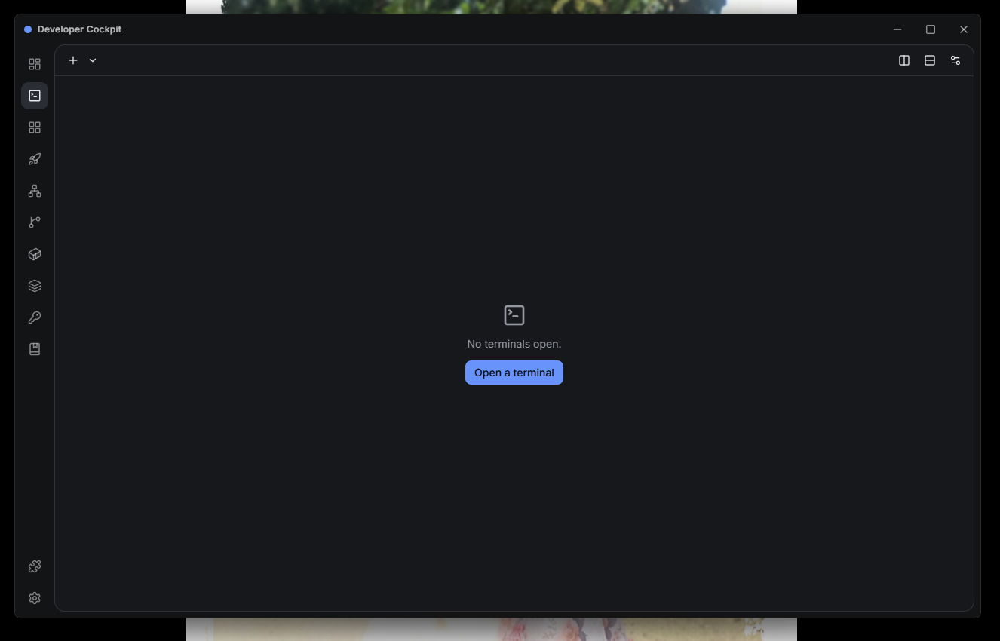

# Developer Cockpit

> **The Unified Developer Workspace for Windows**  
> Bringing terminal sessions, project launch orchestration, port management, git visual workflows, container management, runtime versions, SSH connections, and snippets into one native desktop application.

<p align="center">
  
</p>

---

## 🎬 Live Video Demos

See Developer Cockpit in action across key workflows:

- 🖥️ **[Modern Terminal Demo](https://www.linkedin.com/posts/ruhul-amin-tuhin-abbabb2aa_buildinpublic-rustlang-tauri-activity-7489988657211199488-liuF)** — Tabs, split panes, multi-shell support, themes, and zoom.
- 🚀 **[Project & Workspace Launcher Demo](https://www.linkedin.com/posts/ruhul-amin-tuhin-abbabb2aa_buildinpublic-developertools-rustlang-activity-7492835719602688000-0-cz)** — Multi-step launch orchestration & 1-click workspace restore.
- 🔌 **[Port Manager, Versions & Snippets Demo](https://www.linkedin.com/posts/ruhul-amin-tuhin-abbabb2aa_developertools-devtools-developerproductivity-activity-7493708867860602881-hdVX)** — Live socket inspection, process killing, toolchain version detector.
- 🌿 **[Git Dashboard Demo](https://www.linkedin.com/posts/ruhul-amin-tuhin-abbabb2aa_developertools-git-github-activity-7494808462086873090-Kgso)** — Visual SVG commit graph, stashes, tags, and merge assistants.
- 🐳 **[Docker Workspace & Doctor Demo](https://www.linkedin.com/posts/ruhul-amin-tuhin-abbabb2aa_docker-developertools-devtools-activity-7496613450530320384-CYMc)** — Compose grouping, graph view, streaming logs, and WSL2 Docker Doctor.

*Explore all walkthrough scenarios in [demo/DEMO.md](./demo/DEMO.md).*

---

## Overview

**Developer Cockpit** solves context switching for developers on Windows. Instead of juggling separate windows for terminal shells, Docker Desktop, Git GUIs, Port monitors, SSH clients, and snippet managers, Developer Cockpit provides a unified, high-performance desktop cockpit backed by Tauri v2, Rust, React 19, and SQLite.

---

## Key Highlights

- **⚡ Native Windows Performance:** Built on Tauri v2 and Rust with ConPTY integration, running with sub-second startup times and low memory consumption (~40–80 MB idle).
- **🖥️ Modern Terminal Engine:** Multi-tab, split-pane terminal emulator powered by xterm.js 6 with custom themes, font zooming, and in-terminal search.
- **🚀 Project & Workspace Orchestration:** Multi-step project launchers and one-click workspace snapshot/restore.
- **🔌 Deep System Introspection:** Win32-level port inspection (process tree termination and restart) and WSL2-aware Docker Workspace with streaming logs.
- **🧩 Extensible Plugin System:** Modern Plugin SDK (v2) with sandboxed iframe/worker execution and scoped SQLite key-value persistence.
- **🔒 Secure Architecture:** Zero-password storage for SSH profiles, DPAPI-encrypted licensing storage, and offline Ed25519 cryptographic token validation.

---

## Repository Structure

This repository serves as the public-facing documentation, architecture reference, and partner overview for Developer Cockpit.

```
developer-cockpit/
├── docs/                      # Comprehensive technical & product documentation
│   ├── architecture/          # System architecture, Tauri/Rust backend, React frontend
│   ├── features/              # Feature deep dives and module specifications
│   ├── product/               # Product overview, Free vs Pro matrix
│   ├── development/           # Contribution, setup, and build pipelines
│   ├── plugin-sdk/            # Plugin SDK v2 documentation and guides
│   ├── licensing/             # Cryptographic licensing, DPAPI, and offline validation
│   ├── platform/              # Windows-specific subsystems and platform notes
│   └── business/              # Commercial overview and enterprise partnerships
├── roadmap/                   # Strategic development roadmap
├── demo/                      # Product walkthroughs and video demonstrations
├── partnerships/              # Commercial, technology, and integration partnerships
└── assets/                    # Screenshots, architectural diagrams, and branding
```

---

## Technology Stack

- **Desktop Shell:** Tauri v2 (Rust 2021)
- **UI Framework:** React 19 + TypeScript 5.8 + Vite 7
- **Styling:** Tailwind CSS v4 + Radix UI Primitives
- **State Management:** Zustand 5
- **Local Storage:** SQLite (via `tauri-plugin-sql`)
- **Terminal Backend:** ConPTY (`portable-pty`) + xterm.js 6
- **Cryptography:** Ed25519 (`ed25519-dalek`) + Windows DPAPI

---

## Commercial & Licensing Inquiries

For partnership discussions, technical evaluations, or commercial inquiries, please refer to [`partnerships/PARTNERSHIP.md`](./partnerships/PARTNERSHIP.md) or contact `partnerships@developercockpit.app`.

---

## License

See [`LICENSE`](./LICENSE) for details.
