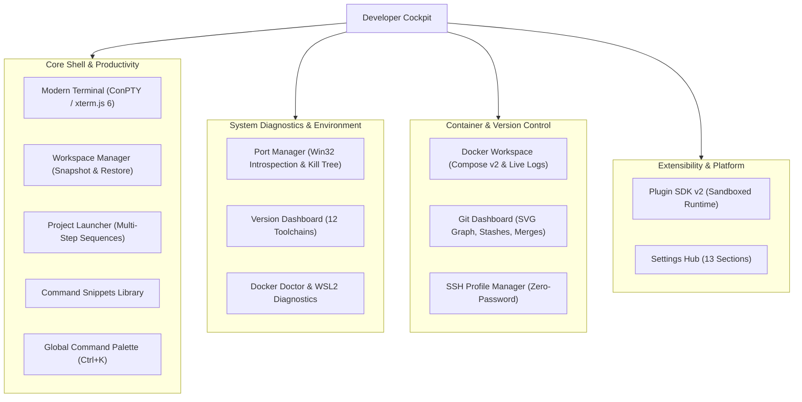
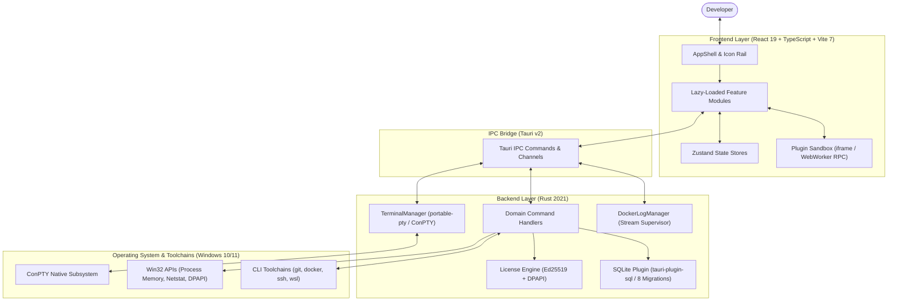

# Developer Cockpit

**An extensible, high-performance desktop workspace designed to unify core developer workflows and eliminate context switching on Windows.**

<p align="center">
  
</p>

---

## Overview

Developer Cockpit consolidates the fragmented utilities a developer juggles throughout the day—terminal emulators, workspace layouts, multi-step project launchers, port monitors, Git visual tools, Docker environments, runtime version inspectors, SSH connection managers, and snippet libraries—into a single, low-latency native application.

Built on **Tauri v2**, **Rust**, **React 19**, and an embedded **SQLite** engine, Developer Cockpit provides deep Windows subsystem integration (ConPTY, DPAPI, Win32 memory traversal) with minimal background resource overhead.

---

## Live Video Walkthroughs

Watch Developer Cockpit demonstrated across core workflows:

| Feature Area | Demonstration | Highlights |
| :--- | :--- | :--- |
| **Modern Terminal** | [Watch Video Demo](https://youtu.be/pbQiyEtL-kg) | ConPTY integration, multi-tab sessions, split panes, shell selection, custom themes, and zoom. |
| **Project & Workspace Launcher** | [Watch Video Demo](https://youtu.be/T-7YOJxmpxM) | Multi-step launch orchestration (IDE, scripts, browser) and 1-click workspace snapshot & restore. |
| **Port Manager, Versions & Snippets** | [Watch Video Demo](https://youtu.be/LAAn1ov8Zik) | Live socket detection, Win32 process memory inspection, process tree killing, toolchain version detector. |
| **Git Dashboard** | [Watch Video Demo](https://youtu.be/KyMxAcBrQBM) | Visual SVG commit graph, branch management, ahead/behind tracking, stashes, tags, and merge assistants. |
| **Docker Workspace & Doctor** | [Watch Video Demo](https://youtu.be/VJgx_NyVtsk) | Compose v2 grouping, SVG dependency graph, streaming logs drawer, and WSL2 Docker Doctor checks. |
| **Plugin System (SDK v2)** | [Watch Video Demo](https://youtu.be/Mu6EPB-zN7g) | Extensible TypeScript SDK, sandboxed execution, manifest validation, and scoped key-value storage. |

*Full demonstration scripts and scenario walkthroughs are documented in [`demo/DEMO.md`](./demo/DEMO.md).*


## Why Developer Cockpit

Every day, developers lose focus and cognitive context switching between standalone terminal windows, container dashboards, Git GUIs, port finders, and note apps:

1. **Context Fragmentation:** Daily workflows are distributed across 5–8 separate windows, each consuming independent memory and operating in isolation.
2. **Setup Friction:** Starting a complex project requires running 4–6 manual commands across multiple terminals, IDEs, and browser windows.
3. **Heavy Desktop Overhead:** Running multiple Electron-based developer tools simultaneously creates heavy idle memory and CPU consumption.
4. **Disjointed State:** Terminal layouts, active container logs, and port bindings are lost across reboots.

Developer Cockpit unifies these operations behind a single icon rail, backed by a shared SQLite store, a unified command palette, and a low-latency native shell.

---

## Key Capabilities

- **ConPTY Modern Terminal:** Multi-tab, recursive split-pane terminal emulator running on Windows ConPTY and xterm.js 6 with live font zooming, in-buffer search, and 6 curated themes.
- **Workspace Layout Restore:** 1-click snapshotting and restoration of entire multi-tab and split-pane terminal sessions with directory bindings.
- **Multi-Step Project Launcher:** Automated launch orchestration chaining IDE startup, terminal build scripts, local web URLs, and folder views with framework auto-detection.
- **Port Manager & Process Inspector:** Real-time TCP/TCPv6 socket monitor with Win32 process memory introspection (extracting command lines and working directories), process tree killing, and restart.
- **Advanced Git Dashboard:** Track local repositories, navigate visual SVG commit history graphs, manage stashes and tags, resolve merge/cherry-pick conflicts, and inspect contributor analytics.
- **Docker Workspace & Doctor:** Compose v2 project grouping, topological service dependency graphs, streaming logs over Tauri Channels, container shell launcher, and WSL2 health checks.
- **Zero-Password SSH Manager:** Organize remote host profiles by groups and favorites with direct terminal connection and zero password storage.
- **Version Dashboard:** Probes and verifies installation status, version strings, and filesystem paths for 12 core developer toolchains.
- **Command Snippets Library:** Categorized snippet repository with single-click execution into active terminal shells.
- **Extensible Plugin System (SDK v2):** Sandboxed iframe/worker runtime supporting custom sidebar modules, overview dashboard widgets, and scoped SQLite storage.

---

## Feature Overview



---

## Free vs. Pro Edition

Developer Cockpit follows an open-core commercial model with capability-driven gating managed via a centralized feature catalog:

| Feature / Capability | Free Edition | Pro Edition |
| :--- | :---: | :---: |
| **Modern Terminal** (Unlimited tabs, split panes, all shells, themes, zoom) | Full | Full |
| **Basic Git Dashboard** (Repository status, branches, ahead/behind tracking) | Full | Full |
| **Project Launcher** (Single-step program & folder launches) | Full | Full |
| **Version Dashboard** (Auto-detects 12 developer toolchains) | Full | Full |
| **Command Snippets Library** (Local storage, categorization, 1-click execution) | Full | Full |
| **Settings Hub** (All 13 configuration sections) | Full | Full |
| **Workspace Manager** (Session snapshotting & layout restore) | — | Full |
| **Multi-Step Project Launcher** (Automated multi-action pipelines) | — | Full |
| **Port Manager** (Win32 process memory inspection, tree kill, restart) | — | Full |
| **Advanced Git Suite** (SVG commit graph, stashes, tags, merge assistants, analytics) | — | Full |
| **Docker Workspace & Doctor** (Compose grouping, graphs, streaming logs, diagnostics) | — | Full |
| **SSH Profile Manager** (Grouped profiles & direct terminal launch) | — | Full |
| **Plugin System & SDK v2** (Sandboxed custom modules, widgets, and scoped storage) | — | Full |

*For complete capability details and architectural gating rules, see [`docs/licensing/`](./docs/licensing/).*

---

## Architecture

Developer Cockpit separates UI presentation from native execution through a typed IPC bridge:



---

## Plugin Ecosystem & SDK (v2)

Developer Cockpit features a dedicated TypeScript SDK (`@developer-cockpit/plugin-sdk`) allowing third parties to build custom tools that run securely inside the cockpit:

```typescript
import { createPlugin, type CockpitApi } from "@developer-cockpit/plugin-sdk";

export default createPlugin({
  id: "my-custom-tool",
  name: "Custom Dev Tool",
  version: "1.0.0",
  sidebar: {
    title: "Custom Tool",
    icon: "rocket",
    mount(container: HTMLElement, api: CockpitApi) {
      container.innerHTML = `<div style="padding: 24px; color: #fff;">
        <h2>Custom Workspace View</h2>
        <button id="run-btn">Execute Task</button>
      </div>`;

      const btn = container.querySelector("#run-btn");
      btn.onclick = () => api.openTerminalTab({ command: "npm run build" });

      return () => { container.innerHTML = ""; };
    }
  }
});
```

*See [`docs/plugin-sdk/`](./docs/plugin-sdk/) for complete API references, authoring guides, and verified code examples.*

---

## Technology Stack

- **Desktop Framework:** [Tauri v2](https://tauri.app/) (Rust 2021 native backend)
- **UI Framework:** React 19 + TypeScript 5.8 + Vite 7
- **Styling:** Tailwind CSS v4 + Radix UI Primitives + Lucide Icons
- **State Management:** Zustand 5
- **Local Storage:** SQLite (via `tauri-plugin-sql` with 8 sequential schema migrations)
- **Terminal Subsystem:** Windows ConPTY (`portable-pty: 0.8`) + xterm.js 6
- **Cryptography:** Ed25519 (`ed25519-dalek: 2.0`) + Windows DPAPI (`CryptProtectData`)

---

## Platform Support

- **Target Operating System:** Microsoft Windows 10 (version 1809+) and Windows 11 (x86_64).
- **Native OS Integrations:**
  - Windows ConPTY pseudo-console subsystem.
  - Windows Data Protection API (DPAPI) user-scoped token encryption.
  - Windows 11 Mica material backdrop blur (`windowEffects: ["mica"]`).
  - Win32 Process Environment Block (PEB) memory inspection.
  - WSL 2 wide-character (UTF-16LE) output decoding.
  - Background process suppression via Win32 `CREATE_NO_WINDOW`.

---

## Security Architecture

- **Zero-Password Storage Policy:** SSH credentials and remote server passwords are never stored in application databases or logs.
- **DPAPI Token Protection:** Sensitive local license tokens are encrypted using Windows DPAPI, preventing cross-user and cross-machine key theft.
- **Sandboxed Plugin Execution:** Third-party plugins execute within isolated sandbox contexts with mediated access over an asynchronous RPC bridge.
- **Memory Safety & Unsafe Boundary:** Core application logic is written in 100% safe Rust, strictly confining `unsafe` blocks to isolated Win32 memory and DPAPI wrappers.
- **Command Injection Prevention:** CLI subprocesses execute via tokenized argument vectors rather than shell string interpolation.

---

## Documentation

Comprehensive technical, architectural, and developer documentation is organized in `docs/`:

- **[Architecture Deep Dives](./docs/architecture/README.md):** System process models, backend command design, frontend React patterns, and Windows integration.
- **[Feature Specifications](./docs/features/README.md):** Detailed technical documentation and capability matrix for all 11 modules.
- **[Commercial & Licensing](./docs/licensing/README.md):** Cryptographic licensing, DPAPI storage, and capability-driven feature flags.
- **[Plugin SDK Reference](./docs/plugin-sdk/README.md):** Manifest schema, `CockpitApi` reference, and step-by-step authoring guides.
- **[Product Demonstrations](./demo/DEMO.md):** Live video walkthroughs and interactive demonstration scenarios.

---

## Roadmap

- [x] **v0.1.0:** Core Native Windows Cockpit (Terminal, Workspaces, Projects, Ports, Git, Docker, Versions, SSH, Snippets, Plugin SDK v2, Offline Ed25519 Licensing).
- [ ] **Phase 2 (Planned):** Centralized Online Plugin Marketplace with 1-click cloud installs.
- [ ] **Phase 3 (Planned):** End-to-end encrypted cloud synchronization for settings, snippets, and team workspaces.
- [ ] **Phase 4 (Exploratory):** POSIX PTY platform abstraction for potential macOS and Linux desktop targets.

*Detailed milestones and implementation phases are outlined in [`roadmap/ROADMAP.md`](./roadmap/ROADMAP.md).*

---

## Project Status

Developer Cockpit is a fully functional, verified native desktop product. The core application architecture, 11 feature modules, Plugin SDK (v2), and Ed25519 licensing engine are complete and active.

---

## Commercial & Partnership Inquiries

For strategic technology partnerships, enterprise deployments, OEM licensing, or technical evaluation:

- **Partnership Guide:** [`partnerships/PARTNERSHIP.md`](./partnerships/PARTNERSHIP.md)
- **Contact:** [ruhulamintuhin715@gmail.com](mailto:ruhulamintuhin715@gmail.com)

---

## License

Documentation, specifications, and SDK definitions in this repository are available under standard evaluation and development terms. See [`LICENSE`](./LICENSE) for details.
