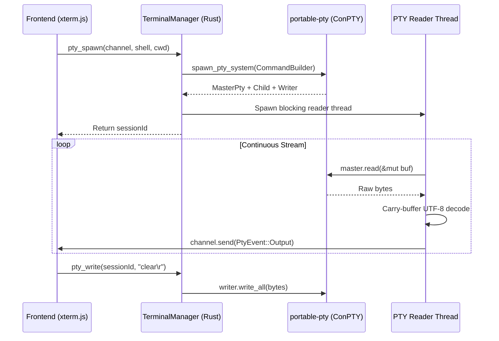

# Developer Cockpit — Backend Architecture

> **Focus:** Rust native services, command handlers, ConPTY integration, Win32 subsystems, and streaming concurrency.

---

## 1. Backend Overview & Crate Layout

The backend is built as a native Rust library (`developer_cockpit_lib`) targeting the 2021 edition. It is structured into clear command domains, licensing subsystems, platform-specific helpers, and database migrations:

```
src-tauri/
├── Cargo.toml                 # Dependencies, features, and profile configurations
├── tauri.conf.json            # Window properties, capabilities, and bundle config
└── src/
    ├── lib.rs                 # Tauri runtime builder, plugin init, IPC registrations
    ├── main.rs                # Native binary entrypoint
    ├── db.rs                  # SQLite migrations and DB connection constants
    ├── platform/
    │   └── mod.rs             # Windows-specific system utilities
    ├── license/               # Cryptographic licensing engine
    │   ├── mod.rs             # Validator trait & payload structures
    │   ├── offline.rs         # Ed25519 signature validator
    │   ├── policy.rs          # 30-day offline grace period evaluator
    │   ├── storage.rs         # Encrypted key storage manager
    │   ├── dpapi.rs           # Win32 DPAPI wrappers (unsafe boundary)
    │   └── sync.rs            # Background license verification task
    └── commands/              # Tauri IPC command modules
        ├── mod.rs             # Command registration exports
        ├── app.rs             # System info & app version metadata
        ├── launcher.rs        # Detached process launcher
        ├── license.rs         # License activation/deactivation IPC
        ├── plugins.rs         # Plugin discovery, reading, and installation
        ├── projects.rs        # Local folder scanner
        ├── ssh.rs             # OpenSSH binary detection
        ├── terminal.rs        # ConPTY PTY manager & channel streaming
        ├── versions.rs        # Developer toolchain version probe
        ├── docker/            # Docker Workspace subsystem
        │   ├── mod.rs         # Container/image/volume listings & actions
        │   ├── compose.rs     # Compose v2 project & service discovery
        │   ├── logs_stream.rs # Live log streaming over Tauri Channel
        │   ├── stats.rs       # Single-shot resource usage probe
        │   └── doctor.rs      # Docker Doctor & WSL2 diagnostics
        ├── git/               # Git Dashboard subsystem
        │   ├── mod.rs         # Status, branch, ahead/behind tracking
        │   ├── log.rs         # Commit log & commit detail parser
        │   ├── ops.rs         # Stashes, tags, checkout, merge, cherry-pick
        │   └── analytics.rs   # Contributor & commit frequency analytics
        └── ports/             # Port Manager subsystem
            ├── mod.rs         # Port list IPC interface
            └── windows.rs     # Netstat & Win32 memory inspection
```

---

## 2. Core Command Handlers

### 2.1 Terminal Subsystem (`commands/terminal.rs`)
- **PTY Session Manager:** `TerminalManager` manages active sessions within a `Mutex<HashMap<u32, PtySession>>`.
- **ConPTY Spawning:** Uses `portable-pty`'s `native_pty_system()`.
- **Channel Streaming:** Spawns a dedicated OS thread per session to read from the master PTY descriptor, streaming chunks wrapped in `PtyEvent::Output { data }` over a Tauri `Channel<PtyEvent>`.
- **UTF-8 Carry Buffer:** Implements a byte carry buffer ensuring that multi-byte UTF-8 sequences split across read buffers are properly assembled before sending to the frontend.



---

### 2.2 Port Manager Subsystem (`commands/ports/`)
- **Socket Discovery:** Executes `netstat -ano -p TCP` and `netstat -ano -p TCPv6` with `CREATE_NO_WINDOW`.
- **Win32 Memory Inspection (`windows.rs`):**
  - Obtains process handle with `PROCESS_QUERY_LIMITED_INFORMATION | PROCESS_VM_READ`.
  - Invokes `NtQueryInformationProcess` to locate the `ProcessEnvironmentBlock` (PEB).
  - Reads `RTL_USER_PROCESS_PARAMETERS` via `ReadProcessMemory` to extract the original command line arguments and working directory for the listening process.
- **Process Tree Killing:** Recursively discovers and terminates child processes before terminating parent processes.

---

### 2.3 Docker Workspace Subsystem (`commands/docker/`)
- **CLI Wrapper Strategy:** Operates strictly via the host's `docker` CLI using `--format` templates and unicode delimiter `\u{1f}`.
- **Compose v2 Detection (`compose.rs`):** Executes `docker compose ls -a --format json` with automatic fallback to NDJSON for older Compose 2.x versions.
- **Streaming Logs (`logs_stream.rs`):** `DockerLogManager` manages `docker logs -f --tail N` child processes, piping stdout and stderr across two reader threads and dispatching to Tauri channels.
- **Docker Doctor (`doctor.rs`):** Checks CLI presence, daemon response, Compose v2, Linux containers mode, reclaimable disk space, and decodes Windows `wsl.exe --status` output formatted as **UTF-16LE**.

---

### 2.4 Git Dashboard Subsystem (`commands/git/`)
- **Repository Health (`mod.rs`):** Resolves repository root (`git rev-parse --show-toplevel`), reads current branch or detached HEAD, calculates ahead/behind counts against upstreams, and parses `git status --porcelain=v2`.
- **History & Log (`log.rs`):** Parses commit hashes, parents, author names, dates, subject, and body.
- **Interactive Operations (`ops.rs`):** Stash push/pop/drop/apply, tag create/delete, checkout, merge, and cherry-pick with conflict state detection.
- **Analytics (`analytics.rs`):** Aggregates commit author frequency and weekly activity timelines.

---

## 3. Error Handling & Safety Boundaries

1. **IPC Error Serialization:** Tauri commands return `Result<T, String>`. Domain errors are converted to human-readable strings before crossing the IPC boundary.
2. **Strict Unsafe Isolation:** All `unsafe` blocks are restricted to Win32 FFI operations in `src-tauri/src/license/dpapi.rs` and `src-tauri/src/commands/ports/windows.rs`.
3. **Graceful Degradation:** Optional tools (Docker, Git, SSH) do not prevent the app from launching; missing CLI dependencies return structured error payloads rendered as user-friendly status banners in the UI.
