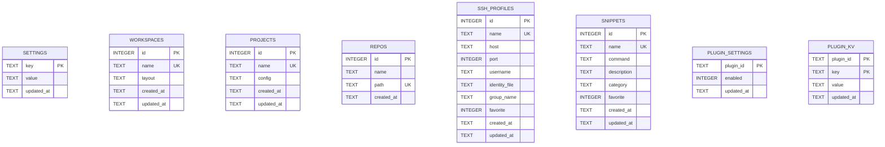

# Developer Cockpit — Data Architecture

> **Focus:** SQLite schema design, migration pipeline, persistence contracts, and query patterns.

---

## 1. Storage Architecture Overview

Developer Cockpit utilizes an embedded **SQLite 3** database for persistent local storage, interfaced via `tauri-plugin-sql`:
- **Database Path:** `%APPDATA%\com.developercockpit.app\cockpit.db`
- **Connection URI:** `sqlite:cockpit.db`
- **Driver:** Embedded SQLite in Rust with frontend bindings via `@tauri-apps/plugin-sql`

---

## 2. Entity-Relationship Schema Diagram

---

## 3. Sequential Migration History (`src-tauri/src/db.rs`)

Database migrations are defined strictly in Rust and applied automatically during application startup in a single transaction:

| Version | Migration Identifier | Purpose & Schema Structure |
| :--- | :--- | :--- |
| **v1** | `create_settings_table` | Key-value application settings table (`key TEXT PRIMARY KEY`, `value TEXT NOT NULL`, `updated_at TEXT`). |
| **v2** | `create_workspaces_table` | Stores terminal layout snapshots and split trees (`name TEXT NOT NULL UNIQUE COLLATE NOCASE`, `layout TEXT NOT NULL` storing JSON). |
| **v3** | `create_projects_table` | Multi-step project definitions (`name TEXT NOT NULL UNIQUE COLLATE NOCASE`, `config TEXT NOT NULL` storing JSON step configs). |
| **v4** | `create_repos_table` | Tracks local git repositories (`name TEXT NOT NULL`, `path TEXT NOT NULL UNIQUE COLLATE NOCASE`). |
| **v5** | `create_ssh_profiles_table` | Stores SSH connection parameters (`host`, `port`, `username`, `identity_file`, `group_name`, `favorite`). **No password column by design.** |
| **v6** | `create_snippets_table` | Single-line terminal command snippets library (`command`, `description`, `category`, `favorite`). |
| **v7** | `create_plugin_settings_table` | Persists user trust and enable/disable state for discovered plugin folders (`plugin_id TEXT PRIMARY KEY`, `enabled INTEGER`). |
| **v8** | `create_plugin_kv_table` | Isolated key-value storage for third-party plugins (`plugin_id`, `key`, `value`, composite primary key `(plugin_id, key)`). |

---

## 4. Query & Persistence Patterns

1. **Frontend Database Access (`src/services/database.ts`):**
   - The frontend accesses SQLite asynchronously via `Database.load("sqlite:cockpit.db")`.
   - Domain services (`project-service.ts`, `ssh-service.ts`, `snippet-service.ts`) execute parameterized SQL statements (`db.execute(sql, [params])`, `db.select(sql, [params])`) to prevent SQL injection vulnerabilities.
2. **JSON Document Columns:**
   - Complex nested hierarchical structures (such as terminal pane split trees in `workspaces.layout` and multi-step execution flows in `projects.config`) are serialized as structured JSON strings within SQLite `TEXT` columns.
3. **Migration Invariance:**
   - Migration versions are strictly sequential and immutable. New database tables or structural modifications are added exclusively by appending a new migration version to `db.rs`.
