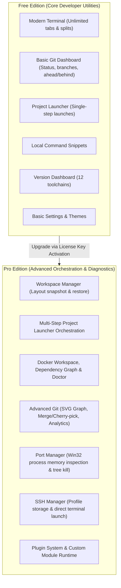

# Developer Cockpit — Edition Architecture

> **Focus:** Free vs. Pro edition boundaries, feature differentiation matrix, and user upgrade experience.

---

## 1. Product Edition Philosophy

Developer Cockpit employs an open-core commercial model designed to provide immense value in the Free tier while reserving advanced orchestration, container inspection, deep system diagnostics, and team workflow features for the Pro edition.

---

## 2. Comprehensive Edition Comparison Matrix

| Capability Area | Free Edition | Pro Edition |
| :--- | :--- | :--- |
| **Terminal Emulator** | Full (Tabs, split panes, themes, search, ConPTY) | Full (Tabs, split panes, themes, search, ConPTY) |
| **Workspaces** | :x: Not available | :white_check_mark: Full snapshot & restore |
| **Project Launcher** | :white_check_mark: Single-step program launch | :white_check_mark: Multi-step automated sequences |
| **Port Manager** | :x: Not available | :white_check_mark: Win32 inspection, kill tree, restart |
| **Git Dashboard** | :white_check_mark: Status, branch, ahead/behind tracking | :white_check_mark: Visual commit graph, stashes, tags, merge/cherry-pick assistants, analytics |
| **Docker Workspace** | :x: Not available | :white_check_mark: Compose v2 grouping, graph, live logs, Docker Doctor |
| **SSH Manager** | :x: Not available | :white_check_mark: Profile management, direct shell connect |
| **Version Dashboard** | :white_check_mark: Full (12 developer toolchains) | :white_check_mark: Full (12 developer toolchains) |
| **Command Snippets** | :white_check_mark: Local snippet library | :white_check_mark: Local snippet library + future sync |
| **Plugin System** | :x: Not available | :white_check_mark: Full SDK v2, sandboxing, custom modules |
| **Settings & Themes** | :white_check_mark: Full 13 configuration sections | :white_check_mark: Full 13 configuration sections |

---

## 3. UI Gating & Upgrade Experience

### 3.1 `ProGate` Component (`src/components/pro/ProGate.tsx`)
When a Free user accesses a Pro-gated section or module:
1. The component intercepts rendering and presents a polished, non-intrusive upgrade banner detailing specific feature benefits.
2. The user can click "Upgrade to Pro" to immediately navigate to the License Activation dialog in Settings.

### 3.2 Navigation Sidebar Badging (`src/components/pro/ProBadge.tsx`)
Pro-only modules (such as Workspaces, Ports, Docker, SSH, and Plugins) display a discreet `PRO` pill badge in the navigation icon rail, allowing users to discover capabilities without deceptive UI barriers.
