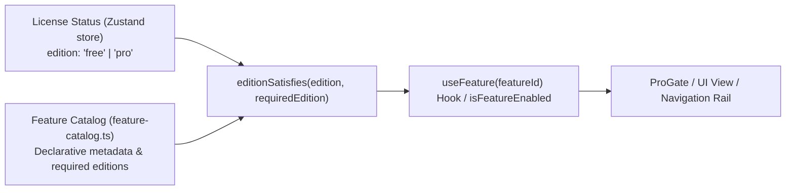

# Developer Cockpit — Feature Flag Architecture

> **Focus:** Feature catalog design, capability gating, and declarative feature flag resolution.

---

## 1. Feature Flag Overview

Developer Cockpit avoids hardcoded edition checks throughout UI components by routing all capability checks through a centralized **Feature Catalog** and declarative feature flag evaluator:



---

## 2. Feature Catalog Schema (`src/services/license/feature-catalog.ts`)

Every gateable capability is cataloged with full metadata, marketing descriptions, and tier requirements:

```typescript
export interface FeatureMetadata {
  id: FeatureId;
  title: string;
  tagline: string;
  benefits: string[];
  requiredEdition: Edition; // 'free' | 'pro'
}
```

### Complete Catalog of Feature Flags

| Feature ID | Display Name | Required Edition | Gated Capabilities |
| :--- | :--- | :--- | :--- |
| `workspaces` | Workspace Manager | **Pro** | Terminal session snapshotting, layout persistence, and one-click workspace restore. |
| `launcher-multi-step` | Multi-Step Launcher | **Pro** | Multi-action project launch sequences (open app + terminal script + URL + folder). Single-step launches remain Free. |
| `docker` | Docker Workspace | **Pro** | Compose v2 grouping, SVG dependency graph, streaming logs drawer, and Docker Doctor. |
| `ssh` | SSH Manager | **Pro** | SSH connection profile manager and direct terminal session initiator. |
| `git-advanced` | Advanced Git Dashboard | **Pro** | Visual SVG commit graph, stash manager, tag manager, cherry-pick/merge assistants, and repository analytics. |
| `ports` | Port Manager | **Pro** | Live socket inspection, Win32 process memory recovery, process tree termination, and restart. |
| `plugins` | Plugin System | **Pro** | Folder-based plugin loading, third-party sidebar modules, and custom dashboard contributions. |
| `snippets-sync` | Snippets Sync | **Pro** | *(Planned / Reserved)* Cross-device snippet synchronization. |
| `cloud-sync` | Cloud Sync | **Pro** | *(Planned / Reserved)* Encrypted settings and workspace cloud synchronization. |

---

## 3. Flag Resolution & UI Binding

1. **State Evaluation:**
   ```typescript
   export function editionSatisfies(edition: Edition, required: Edition): boolean {
     return required === "free" || edition === "pro";
   }
   ```
2. **Component Integration (`ProGate.tsx`):**
   ```tsx
   <ProGate feature="docker">
     <DockerWorkspaceView />
   </ProGate>
   ```
   If the active edition does not satisfy the feature's requirement, `ProGate` automatically renders an inline upgrade card or directs the user to `UpgradePage.tsx` showing the cataloged benefits list.
