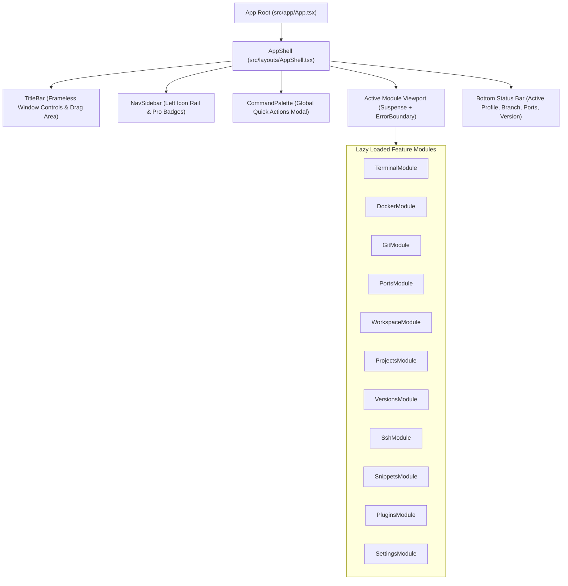
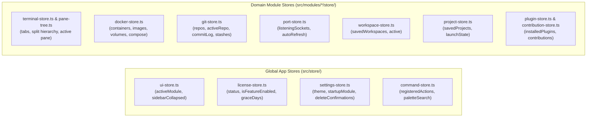
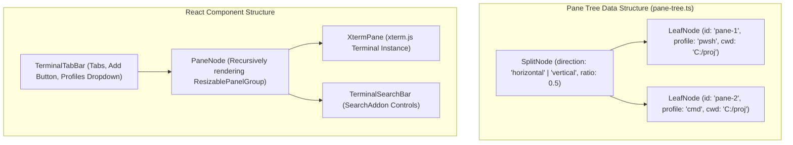

# Developer Cockpit — Frontend Architecture

> **Focus:** React 19 component hierarchy, state management with Zustand, module lifecycle contracts, and UI performance engineering.

---

## 1. Technology & Design Foundation

The frontend is constructed using modern web and desktop technologies:
- **Framework:** React 19 (`react: ^19.1.0`, `react-dom: ^19.1.0`) with TypeScript 5.8
- **Build Tool:** Vite 7 with `@vitejs/plugin-react` and `@tailwindcss/vite`
- **State Management:** Zustand 5 (`zustand: ^5.0.14`)
- **Component Primitives:** Radix UI (`radix-ui: ^1.6.2`) & Lucide React (`lucide-react: ^1.24.0`)
- **Styling:** Tailwind CSS v4 with CSS variable design tokens and dark mode support
- **Layout & Splitting:** `react-resizable-panels: ^4.12.2`
- **Terminal Canvas:** xterm.js 6 (`@xterm/xterm: ^6.0.0`) with WebGL/Canvas rendering, FitAddon, SearchAddon, and WebLinksAddon

---

## 2. Component Hierarchy & Layout Structure

The layout hierarchy is managed by `AppShell.tsx`, which structures the viewport into four distinct zones:



---

## 3. Module Lifecycle & Contract

Every top-level feature module conforms to the `ModuleDefinition` interface defined in `src/types/module.ts`:

```typescript
export interface ModuleDefinition {
  id: string;
  name: string;
  icon: LucideIcon;
  component: React.LazyExoticComponent<React.ComponentType>;
  requiredEdition: "free" | "pro";
  shortcut?: string;
  order: number;
}
```

### 3.1 Lazy Loading & Isolation
- **On-Demand Loading:** Modules are loaded using `React.lazy()`. Unopened modules consume zero initial parsing, rendering, or memory overhead.
- **State Isolation:** Each module manages its own local Zustand store or service workers (e.g., `docker-store.ts`, `git-store.ts`, `port-store.ts`), preventing state pollution across the application.

---

## 4. State Management Architecture (Zustand 5)

State is organized into two distinct layers: **Global App Stores** and **Domain-Specific Module Stores**:



---

## 5. Terminal Subsystem & Pane Tree Architecture

The Terminal subsystem represents the most complex UI component, orchestrating multiple tabs, recursive split panes, and independent xterm.js instances:



### 5.1 Terminal Instance Registry (`terminal-instances.ts`)
- Manages the lifecycle of xterm.js objects independently of React re-render cycles.
- Binds keyboard events, wheel scrolling, selection copy, search decorations, and resize observers to the underlying ConPTY session.

---

## 6. Performance Engineering & UI Optimizations

1. **Windowed / Virtualized Log Viewer (`LogViewer.tsx`):**
   - Renders container logs using a fixed-height sliding window over a 5,000-line circular ring buffer.
   - Flushes incoming streaming chunks in batched ~80 ms intervals to eliminate DOM rendering thrashing during high-volume log bursts.
2. **Pure SVG Graph Layouts (`WorkspaceGraph.tsx`, `graph-layout.ts`):**
   - Docker Compose dependency graphs and Git commit history graphs are calculated using pure topological sorting algorithms and rendered via lightweight, GPU-accelerated SVG elements without heavy external canvas libraries.
3. **Opt-In Polling Cadence:**
   - Resource-intensive background polls (such as `docker stats` or Port Manager auto-refresh) are disabled by default and strictly restricted to when their respective modules are currently mounted in the viewport.
