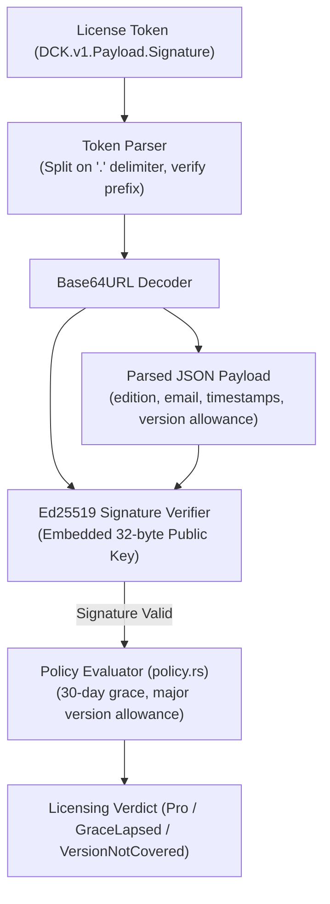

# Developer Cockpit — Licensing Architecture

> **Focus:** Ed25519 digital signature validation, token specifications, DPAPI encrypted storage, and offline policy evaluation.

---

## 1. Cryptographic Token Format (`DCK.v1`)

Developer Cockpit employs an offline-first cryptographic licensing architecture. License keys are compact, tamper-proof alphanumeric tokens formatted as:

```
DCK.v1.<base64url_json_payload>.<base64url_ed25519_signature>
```



### 1.1 Payload JSON Schema
```json
{
  "v": 1,
  "edition": "pro",
  "email": "developer@example.com",
  "issued_at": 1700000000,
  "expires_at": null,
  "license_id": "9b1deb4d-3b7d-4bad-9bdd-2b0d7b3dcb6d",
  "issuance_timestamp": 1750000000,
  "major_version_allowance": 1
}
```

| Field | Type | Description |
| :--- | :--- | :--- |
| `v` | `u32` | Schema version identifier (currently `1`). |
| `edition` | `string` | Target tier (`"pro"`). |
| `email` | `string` | Licensed user or organization identifier. |
| `issued_at` | `i64` | Unix timestamp of original purchase. |
| `expires_at` | `Option<i64>` | Unix timestamp of license expiration (`null` for perpetual licenses). |
| `license_id` | `string` | Unique license UUID. |
| `issuance_timestamp` | `Option<i64>` | Unix timestamp when the token was signed or re-verified. |
| `major_version_allowance` | `Option<u32>` | Maximum covered application major version (e.g. `1` covers v1.x). |

---

## 2. Windows DPAPI Protected Storage (`license/dpapi.rs`)

To prevent unauthorized extraction or cloning across users, license tokens are stored encrypted using the **Windows Data Protection API (DPAPI)**:
- **Storage Location:** `%APPDATA%\com.developercockpit.app\license.enc`
- **Encryption Primitive:** `CryptProtectData` (`CRYPTPROTECT_UI_FORBIDDEN`)
- **Decryption Primitive:** `CryptUnprotectData`
- **Security Scope:** Bound to the local Windows user account and hardware master key. Plaintext license keys are never stored on disk.

---

## 3. Business Rules & Offline Policy Evaluator (`license/policy.rs`)

A cryptographically valid key is evaluated by `policy::evaluate()`:

1. **Major Version Allowance:**
   If `app_major_version() > payload.major_version_allowance`, the verdict is `Verdict::VersionNotCovered`.
2. **30-Day Offline Grace Window:**
   - When online verification is enabled, tokens must be re-signed every 30 days (`OFFLINE_GRACE_SECS = 2,592,000`).
   - If offline beyond 30 days, the verdict becomes `Verdict::GraceLapsed`.
   - In shipping builds without a verification server (`VERIFY_URL = ""`), the grace countdown is suspended, allowing perpetual licenses to run offline indefinitely.

---

## 4. Key Generator CLI (`scripts/keygen/`)

The repository includes a dedicated standalone Rust CLI for minting and verifying license keys:
- **Generate Keypair:** `cargo run -p keygen -- generate-keypair`
- **Sign License:** `cargo run -p keygen -- sign --email user@example.com --edition pro --secret-key <hex>`
- **Verify License:** `cargo run -p keygen -- verify --token DCK.v1... --public-key <hex>`
