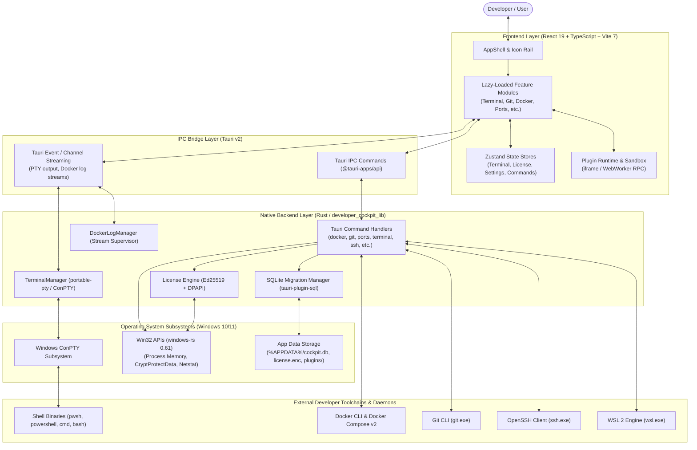

# Developer Cockpit — Architectural Overview

> **Target Audience:** Senior & Staff Software Engineers, Engineering Managers, Technical Product Managers, and Technology Partners.  
> **Status:** Verified against Developer Cockpit v0.1.0 codebase.

---

## 1. System Vision & Purpose

Developer Cockpit is an integrated, low-overhead developer workspace desktop application designed for Windows. It consolidates daily developer tooling—terminal emulators, workspace layout management, multi-step project orchestration, TCP port monitoring, git visualization, container workflows, runtime version discovery, SSH profile management, and snippet libraries—into a single native client.

The system is architected around three foundational design tenets:
1. **Low-Latency Native Execution:** Utilizing Tauri v2 and Rust rather than heavy Chromium-based wrapper daemons to minimize memory footprint (~40–80 MB idle) and enable instant startup.
2. **Contract-Driven Modularization:** Independent frontend modules conforming to strict lifecycle contracts (`ModuleDefinition`), lazy-loaded on demand to ensure zero performance overhead for unopened modules.
3. **Deep OS & Toolchain Integration:** Direct integration with Windows pseudo-consoles (ConPTY), Win32 process memory inspection, Windows DPAPI encryption, and system-level CLI toolchains (`git`, `docker`, `ssh`).

---

## 2. End-to-End Execution Flow

The following diagram illustrates the layered execution hierarchy of Developer Cockpit from the user interface down to the operating system kernel and external developer runtimes:

---

## 3. High-Level Subsystems

### 3.1 Presentation & UI Shell (React 19)
- **AppShell (`src/layouts/AppShell.tsx`):** Coordinates the left navigation icon rail, top frameless drag title bar, active module viewport, and status bar.
- **Module Registry (`src/app/module-registry.ts`):** Dynamic loader registry declaring built-in modules, icons, keyboard shortcuts, and edition requirements.
- **Command Palette (`src/components/command-palette.tsx`):** Unified `Ctrl+K` searchable action index.

### 3.2 Desktop & IPC Bridge (Tauri v2)
- Manages native window lifecycle, Mica acrylic backdrop materials, and frameless window controls.
- Mediates typed asynchronous IPC requests (`invoke`) and high-throughput bidirectional streams (`Channel`).

### 3.3 Backend Execution Engine (Rust)
- **Zero Heavy Background Services:** Commands execute on demand via asynchronous tokio tasks.
- **PTY Session Manager (`src-tauri/src/commands/terminal.rs`):** Spawns and supervises ConPTY processes, piping UTF-8 terminal byte streams to xterm.js instances.
- **Port Manager (`src-tauri/src/commands/ports/windows.rs`):** Inspects Win32 process memory structures (`RTL_USER_PROCESS_PARAMETERS`) to map listening network sockets to working directories and command lines.

### 3.4 Data & Persistence Subsystem (SQLite)
- Local embedded database (`cockpit.db`) with 8 append-only schema migrations managing settings, workspaces, projects, repository tracking, SSH profiles, snippets, and plugin key-value records.

### 3.5 Cryptographic Licensing Engine
- Implements Ed25519 public-key signature verification for `DCK.v1` license tokens.
- Protects local license storage via Windows DPAPI (`CryptProtectData`), strictly enforcing a 30-day offline grace period evaluator.

---

## 4. Architectural Documents Index

For deep-dive documentation into specific architectural subsystems, consult the companion documents:

| Document | Focus Area |
| :--- | :--- |
| **[SYSTEM_ARCHITECTURE.md](./SYSTEM_ARCHITECTURE.md)** | End-to-end component breakdown and runtime process model. |
| **[FRONTEND_ARCHITECTURE.md](./FRONTEND_ARCHITECTURE.md)** | React 19 structure, state management, module contract, and styling. |
| **[BACKEND_ARCHITECTURE.md](./BACKEND_ARCHITECTURE.md)** | Rust command modules, ConPTY streaming, Win32 bindings, and concurrency. |
| **[DATA_ARCHITECTURE.md](./DATA_ARCHITECTURE.md)** | SQLite schema migrations, storage contracts, and query patterns. |
| **[FEATURE_FLAG_ARCHITECTURE.md](./FEATURE_FLAG_ARCHITECTURE.md)** | Client-side feature catalog and granular capability gating. |
| **[EDITION_ARCHITECTURE.md](./EDITION_ARCHITECTURE.md)** | Free vs. Pro edition boundaries, UX gates, and upgrade paths. |
| **[LICENSING_ARCHITECTURE.md](./LICENSING_ARCHITECTURE.md)** | Ed25519 token cryptography, DPAPI security, and offline policy evaluation. |
| **[PLUGIN_ARCHITECTURE.md](./PLUGIN_ARCHITECTURE.md)** | Plugin SDK v2, sandboxing, manifest schema, and contribution points. |
| **[SECURITY_ARCHITECTURE.md](./SECURITY_ARCHITECTURE.md)** | Threat model, zero-password policies, unsafe code isolation, and DPAPI. |
| **[WINDOWS_INTEGRATION.md](./WINDOWS_INTEGRATION.md)** | ConPTY, Win32 process memory introspection, Mica blur, and WSL2 support. |
