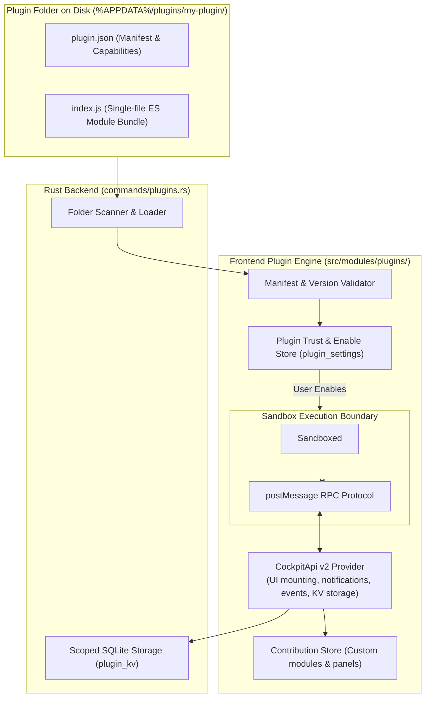

# Developer Cockpit — Plugin Architecture

> **Focus:** Plugin SDK v2, manifest specification, sandboxed execution runtime, and contribution points.

---

## 1. Plugin Architecture Overview

Developer Cockpit provides an extensible plugin system allowing third-party developers and enterprise teams to introduce custom modules, dashboard panels, and workflow automations into the cockpit.



---

## 2. Plugin Directory & Manifest Specification

A plugin resides in `%APPDATA%\com.developercockpit.app\plugins\<folder>\` consisting of two required files:
```
my-plugin/
├── plugin.json       # Plugin manifest
└── index.js          # ES module entrypoint
```

### 2.1 Manifest Schema (`plugin.json`)
```json
{
  "id": "kubernetes-viewer",
  "name": "Kubernetes Cluster Viewer",
  "version": "1.0.0",
  "description": "Monitor and inspect local Kubernetes pods and services.",
  "icon": "package",
  "api": 2,
  "minAppVersion": "0.1.0"
}
```

| Field | Required | Description |
| :--- | :--- | :--- |
| `id` | Yes | Unique lowercase kebab-case identifier (`^[a-z][a-z0-9-]{1,31}$`). |
| `name` | Yes | Human-readable display name. |
| `version` | Yes | Semantic version string. |
| `description` | No | Short description shown in the Marketplace/Plugins list. |
| `icon` | No | Icon identifier (e.g., `blocks`, `package`, `rocket`, `wrench`, `zap`). |
| `api` | No | Plugin API version (`2` for modern SDK plugins). |
| `minAppVersion` | No | Minimum supported Developer Cockpit version. |

---

## 3. Sandboxing & Runtime Execution (`plugin-sandbox.ts`)

To protect user environments and maintain host stability:
1. **Isolated Execution Contexts:** Plugins execute inside hidden sandboxed `<iframe>` or `WebWorker` contexts.
2. **Strict RPC Mediation:** The plugin code has no direct access to the parent DOM or host window. All interactions cross an asynchronous `postMessage` RPC bridge.
3. **Disabled by Default:** Newly discovered plugins on disk remain disabled until explicitly enabled by the user in the Plugins module, establishing a clear trust decision.

---

## 4. `CockpitApi` (v2) Capabilities

Plugins interacting via `@developer-cockpit/plugin-sdk` receive the `CockpitApi` instance exposing:

- **`storage`:** Scoped key-value storage backed by SQLite (`plugin_kv` table). A plugin cannot access or overwrite keys belonging to other plugins or core settings.
- **`notifications`:** Display native non-blocking toast notifications in the cockpit.
- **`contributions`:** Register custom sidebar icon rail entries or contribute custom metric panels to the main Overview Dashboard.
- **`events`:** Subscribe to application lifecycle events (e.g. active workspace switch, theme toggle).
