# Developer Cockpit — Security Architecture

> **Focus:** Threat model, credential handling, DPAPI encryption, memory safety boundaries, and sandbox isolation.

---

## 1. Security Architecture Principles

Developer Cockpit is designed with a defense-in-depth security posture tailored for desktop environments:

```mermaid
graph TD
    subgraph ZeroTrustSecrets ["1. Zero-Password Policy"]
        SSHNoPwd["SSH Profiles Table: Zero password columns"]
        ShellAuth["Interactive terminal or SSH Agent handles auth"]
    end

    subgraph DPAPIEncryption ["2. Encrypted Token Storage"]
        RawLicense["DCK.v1 License String"]
        DPAPI["Windows DPAPI (CryptProtectData)"]
        EncDisk["%APPDATA%/license.enc (User & Hardware Bound)"]
        RawLicense --> DPAPI --> EncDisk
    end

    subgraph UnsafeIsolation ["3. Memory Safety & FFI Boundary"]
        SafeRust["100% Safe Rust Core Business Logic"]
        UnsafeBoundary["Strictly Confined unsafe Blocks:\n- license/dpapi.rs\n- commands/ports/windows.rs"]
        SafeRust -.-> UnsafeBoundary
    end

    subgraph PluginIsolation ["4. Sandboxed Extensibility"]
        PluginCode["Untrusted Third-Party Plugin Code"]
        Sandbox["Sandboxed <iframe> / WebWorker Host"]
        RPC["postMessage Typed RPC Boundary"]
        PluginCode --> Sandbox --> RPC
    end
```

---

## 2. Threat Modeling & Mitigations

### 2.1 SSH Credential Theft Mitigation
- **Threat:** Malicious software or local file inspection extracting stored SSH passwords from application configuration files.
- **Architectural Mitigation:** Developer Cockpit enforces a **Zero-Password Storage Policy**. The database schema (`ssh_profiles`) contains no password columns. SSH connections rely on system SSH keys (`identity_file`), the running SSH Agent, or interactive password prompts inside the live terminal pane.

### 2.2 License Key Extraction & Tampering
- **Threat:** Unlicensed distribution of copied license files or modification of license payload data.
- **Architectural Mitigation:**
  1. **Ed25519 Cryptographic Signatures:** Every license payload is signed with an Ed25519 private key. Tampering with any payload field (such as expiration or email) invalidates the signature.
  2. **Windows DPAPI Encryption:** The license string on disk is encrypted via `CryptProtectData` with `CRYPTPROTECT_UI_FORBIDDEN`. The encrypted blob can only be decrypted by the same Windows user account on the same machine.

### 2.3 Command Injection & Subprocess Execution
- **Threat:** Malicious inputs in container IDs, repository paths, or port numbers attempting shell injection.
- **Architectural Mitigation:**
  - Subprocess calls (`git`, `docker`, `netstat`) execute via explicit argument vectors (`std::process::Command::args`), avoiding shell string interpolation.
  - Container and branch identifiers pass through strict regex sanitization filters (`guard_ref`).

### 2.4 Plugin Sandboxing & Malicious Plugins
- **Threat:** A third-party plugin attempting to steal session data, read arbitrary files, or manipulate the host DOM.
- **Architectural Mitigation:**
  - Plugins run in a sandboxed execution frame without direct access to the parent `window` or DOM.
  - All operations must be requested through the `CockpitApi` over an asynchronous `postMessage` protocol.
  - Newly discovered plugins are disabled by default until the user explicitly toggles their trust state.

### 2.5 Unsafe Code Confinement
- Rust's memory safety guarantees apply across the entire application.
- All FFI interactions with Win32 APIs requiring `unsafe` are strictly isolated to:
  - `src-tauri/src/license/dpapi.rs`: Allocating and freeing `CRYPT_INTEGER_BLOB` structures.
  - `src-tauri/src/commands/ports/windows.rs`: Reading `RTL_USER_PROCESS_PARAMETERS` via `ReadProcessMemory`.
