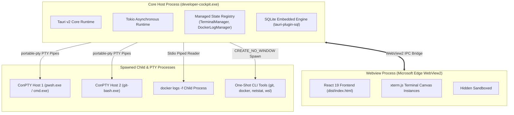
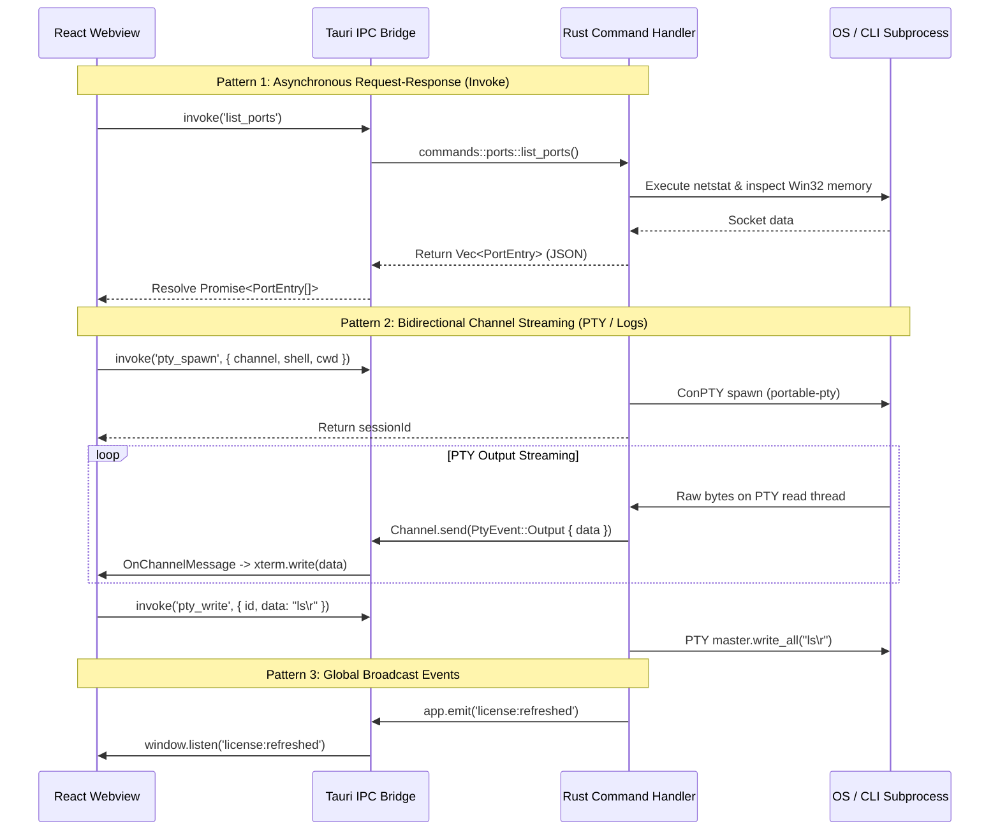
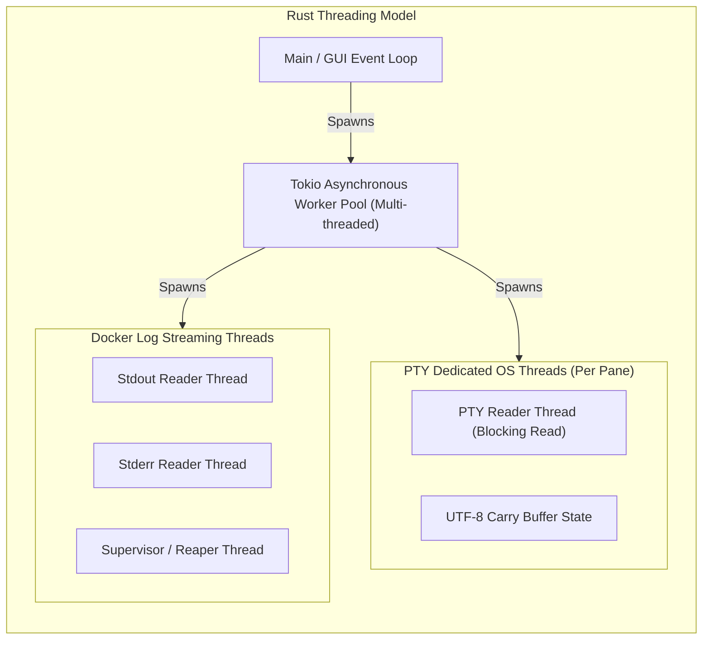
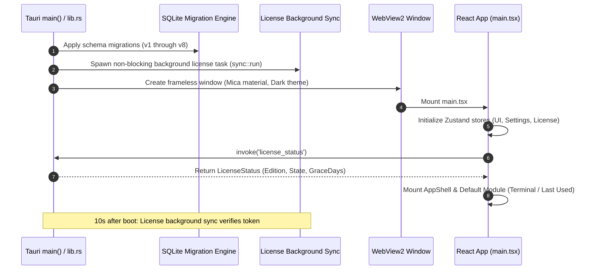

# Developer Cockpit — System Architecture

> **Focus:** End-to-end component breakdown, process model, concurrency, and IPC communication.

---

## 1. Process & Runtime Model

Developer Cockpit executes as a hybrid desktop application utilizing Tauri v2's multi-process architecture on Windows:

### 1.1 Process Boundaries
1. **Core Host Process (`developer-cockpit.exe`):**
   - Implemented in Rust (`developer_cockpit_lib`).
   - Hosts the Tokio async runtime, Tauri event loop, and OS integration hooks.
   - Manages stateful subsystems: PTY master handles, streaming supervisors, and SQLite connection pools.
2. **Renderer Process (Microsoft Edge WebView2):**
   - Runs the compiled React 19 single-page application (`dist/`).
   - Handles DOM manipulation, canvas rendering for xterm.js, CSS animations, and user interactions.
   - Operates in a secure context communicating with the host process via Tauri's JSON-RPC bridge.
3. **Child Subprocesses:**
   - **PTY Processes:** Spawned via `portable-pty` using Windows ConPTY. Each terminal pane owns a dedicated PTY subprocess.
   - **Streaming Daemons:** Child processes (such as `docker logs -f`) spawned with piped stdout/stderr.
   - **One-Shot Probes:** Short-lived CLI commands (`git status`, `netstat -ano`, `wsl.exe --status`, `where.exe`) executed with Win32 flag `CREATE_NO_WINDOW = 0x08000000` to prevent console window flickering.

---

## 2. Inter-Process Communication (IPC) Patterns

Developer Cockpit utilizes three distinct IPC patterns across its lifecycle:

---

## 3. Concurrency & Threading Model

To ensure the UI thread never freezes, heavy operations and long-running streams execute across dedicated asynchronous and worker threads:

### 3.1 PTY Stream Isolation
- Every active terminal pane allocates a background OS thread dedicated to blocking reads on the PTY stdout descriptor.
- Output bytes pass through a custom UTF-8 carry-buffer to prevent multi-byte characters (such as emojis or non-ASCII identifiers) from being split across streaming chunk boundaries before transmission to the webview.

### 3.2 Docker Stream Supervision
- Spawns independent stdout and stderr reader threads.
- A supervisor thread monitors child process exit status, cleans up file descriptors, prevents zombie processes, and dispatches an `Exit` event over the Tauri Channel.

---

## 4. Application Lifecycle & Boot Sequence

---

## 5. Subsystem Summary

| Subsystem | Primary Implementation | Threading Strategy | Failure Isolation |
| :--- | :--- | :--- | :--- |
| **Terminal PTY** | `src-tauri/src/commands/terminal.rs` | 1 dedicated OS thread per pane | PTY crash emits `Exit` event without crashing the host app. |
| **Port Inspection** | `src-tauri/src/commands/ports/` | Tokio worker task | Win32 memory read failures fall back gracefully to basic netstat info. |
| **Docker Engine** | `src-tauri/src/commands/docker/` | Tokio worker + dedicated log readers | Missing Docker CLI or daemon offline returns structured diagnostic errors. |
| **Git Engine** | `src-tauri/src/commands/git/` | Tokio worker task | Corrupt repositories or missing git binaries return graceful error states. |
| **Database** | `src-tauri/src/db.rs` | Connection pool via `tauri-plugin-sql` | Migrations run sequentially on boot within a single transaction. |
| **Licensing** | `src-tauri/src/license/` | Tokio non-blocking timer | Background verification network failures are completely silent. |
