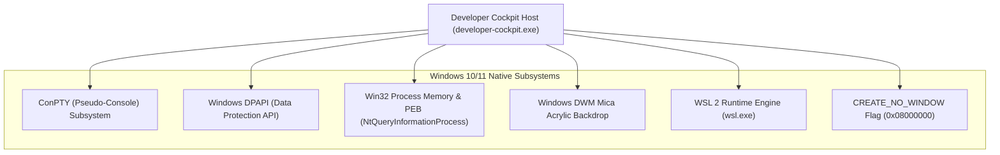

# Developer Cockpit — Windows Platform Integration

> **Focus:** ConPTY pseudo-terminals, Win32 process memory introspection, DPAPI encryption, Mica blur styling, and WSL2 support.

---

## 1. Windows Integration Overview

Developer Cockpit is specifically engineered to take full advantage of modern Windows 10/11 operating system subsystems, delivering performance and features unmatched by generic cross-platform wrappers:



---

## 2. Deep Windows Native Subsystems

### 2.1 ConPTY Pseudo-Console Integration
- **Mechanism:** Integrates with Windows ConPTY via `portable-pty`'s `native_pty_system()`.
- **Advantage:** Provides true VT100 / ANSI escape sequence terminal emulation directly connected to native Windows shells (`pwsh.exe`, `powershell.exe`, `cmd.exe`, `bash.exe`), supporting interactive tools like `vim`, `htop`, and colorized outputs.

### 2.2 Win32 Process Memory Introspection (`commands/ports/windows.rs`)
- **Challenge:** Standard Windows APIs (`netstat`, `GetExtendedTcpTable`) identify listening PIDs, but do not provide the command-line arguments or working directory of the listening process.
- **Implementation:**
  1. Opens a query handle to the process (`PROCESS_QUERY_LIMITED_INFORMATION | PROCESS_VM_READ`).
  2. Queries the `ProcessBasicInformation` via `NtQueryInformationProcess` to retrieve the address of the `ProcessEnvironmentBlock` (PEB).
  3. Traverses into `RTL_USER_PROCESS_PARAMETERS` via `ReadProcessMemory` to read the raw Unicode strings for `CommandLine` and `CurrentDirectory`.
- **Result:** Allows developers to immediately see whether port 3000 is occupied by a Next.js app in `C:\work\web` or an Express app in `C:\work\api`, and restart the process in place.

### 2.3 Windows DPAPI (`license/dpapi.rs`)
- **API:** `CryptProtectData` and `CryptUnprotectData` from `windows::Win32::Security::Cryptography`.
- **Flags:** `CRYPTPROTECT_UI_FORBIDDEN`.
- **Advantage:** Hardware-backed and user-account-bound token encryption without requiring manual master passwords.

### 2.4 WSL 2 (Windows Subsystem for Linux) Diagnostics
- **Command:** `wsl.exe --status`.
- **UTF-16LE Decoding:** Windows console utilities like `wsl.exe` output wide-character text formatted in **UTF-16LE**. The backend custom-decodes these raw byte streams into standard UTF-8 strings for Docker Doctor diagnostics.

### 2.5 Windows 11 Mica Material & Frameless Window
- **Configuration (`tauri.conf.json`):**
  ```json
  "decorations": false,
  "transparent": true,
  "theme": "Dark",
  "windowEffects": {
    "effects": ["mica"]
  }
  ```
- **Custom Title Bar (`src/components/title-bar/`):** Implements Windows 11 native minimize, maximize/restore, and close behaviors with frameless drag regions.

### 2.6 Console Window Suppression (`CREATE_NO_WINDOW`)
- To prevent unsightly black console windows from momentarily flashing on the screen when running CLI probes, every child process spawn across the Rust backend applies:
  ```rust
  use std::os::windows::process::CommandExt;
  const CREATE_NO_WINDOW: u32 = 0x0800_0000;

  cmd.creation_flags(CREATE_NO_WINDOW);
  ```
