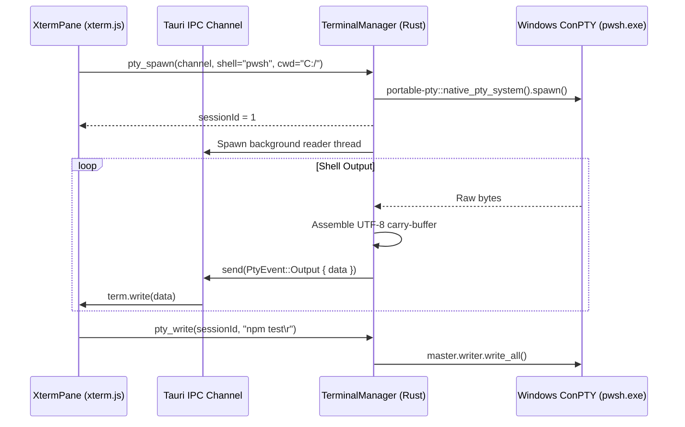

# Modern Terminal & Multi-Pane Shell

> **Status:** VERIFIED (Phase 2 & Phase 13 Implementation)  
> **Source Locations:** `src/modules/terminal/`, `src-tauri/src/commands/terminal.rs`

---

## Overview

The **Modern Terminal** is Developer Cockpit's core shell execution engine. Built directly on Microsoft Windows Pseudo Console (**ConPTY**) via Rust's `portable-pty` crate and rendered using **xterm.js 6**, it delivers low-latency, full-featured terminal emulation for multiple tabs and arbitrary recursive split panes.

---

## Problem It Solves

Windows developers frequently manage multiple disparate console windows (PowerShell, Command Prompt, WSL bash, Git Bash). Switching between detached OS console windows breaks productivity and lacks integrated session persistence, uniform theming, and layout management.

---

## Capabilities

- **ConPTY Native Emulation:** True VT100 / ANSI escape code processing, supporting complex CLI interactive tools (`vim`, `htop`, `tmux`, interactive CLI prompts).
- **Multi-Tab Sessions:** Independent tabs running separate or mixed shell environments.
- **Arbitrary Split Panes:** Recursive horizontal and vertical split layouts with interactive drag resizing via `react-resizable-panels`.
- **Automatic Shell Discovery:** Automatically resolves installed shells (`pwsh.exe`, `powershell.exe`, `cmd.exe`, `bash.exe`) via `where.exe`.
- **In-Terminal Search:** Text search with forward/backward navigation and match highlighting via `@xterm/addon-search`.
- **Dynamic Font Zoom:** In-place font scaling via `Ctrl + / - / 0`.
- **Smart Copy / Paste:** `Ctrl+C` copies selections when text is highlighted or sends `SIGINT` when no selection exists; optional copy-on-select.

---

## User Workflow

1. Open the Terminal module via the left icon rail or `Ctrl+1`.
2. Click `+` or press `Ctrl+Shift+T` to open a new tab with the default shell.
3. Click the split icons or press `Ctrl+Shift+D` (vertical split) or `Ctrl+Shift+E` (horizontal split) to split the active pane.
4. Use `Ctrl+Shift+F` to search through the terminal buffer.
5. Close panes with `Ctrl+Shift+W`.

---

## Technical Implementation

- **Frontend:**
  - `TerminalModule.tsx`: Root terminal container managing tabs, toolbar, and settings modal.
  - `PaneNode.tsx`: Recursive component rendering `ResizablePanelGroup` and `ResizablePanel`.
  - `XtermPane.tsx`: Renders the xterm.js instance and handles DOM canvas attachment.
  - `terminal-instances.ts`: Manages the lifecycle of xterm.js objects and binds keyboard/mouse events.
  - `pane-tree.ts`: Pure tree data structure representing split hierarchies.
- **Backend (`src-tauri/src/commands/terminal.rs`):**
  - `TerminalManager`: Thread-safe registry (`Mutex<HashMap<u32, PtySession>>`) managing ConPTY handles.
  - `pty_spawn`: Spawns child shells using `portable-pty` and establishes a streaming Tauri `Channel<PtyEvent>`.
  - `pty_write`: Dispatches keystrokes directly to the master PTY writer.
  - `pty_resize`: Sends column/row dimension updates to ConPTY.
  - `pty_kill`: Gracefully terminates the running shell process and frees OS handles.

---

## Architecture

---

## Dependencies

- **Rust:** `portable-pty: 0.8`, `tauri: 2.x`
- **Frontend:** `@xterm/xterm: ^6.0.0`, `@xterm/addon-fit: ^0.11.0`, `@xterm/addon-search: ^0.16.0`, `@xterm/addon-web-links: ^0.12.0`, `react-resizable-panels: ^4.12.2`

---

## Free / Pro Availability

- **Free Edition:** Full unlimited access to all terminal features (unlimited tabs, split panes, all shells, themes, and search).
- **Pro Edition:** Same terminal capabilities; enables saving live terminal pane configurations as reusable **Workspaces**.

---

## Configuration

Persisted in SQLite via `terminal-settings-store.ts`:
- `defaultProfile`: Default shell spawned for new tabs (`powershell`, `pwsh`, `cmd`, `git-bash`).
- `fontSize`: Base font size (default: 13px).
- `fontFamily`: Monospace font family (default: `'JetBrains Mono Variable', Consolas, monospace`).
- `lineHeight`: Terminal line spacing factor (default: 1.2).
- `cursorStyle`: `block` | `underline` | `bar`.
- `cursorBlink`: Boolean toggle.
- `scrollback`: History buffer limit (default: 5,000 lines).
- `copyOnSelect`: Boolean toggle.

---

## Limitations

- **Windows Exclusive:** ConPTY integration is strictly tied to Windows 10/11 native APIs.
- **No Direct Sudo Elevation:** Running elevated terminal sessions requires launching Developer Cockpit itself as Administrator.

---

## Extension Points

- Custom shell profiles can be added via `profiles.ts` with custom binary paths and start arguments.
- Plugins can open dedicated terminal tabs and execute commands via `CockpitApi`.

---

## Future Improvements

- [ ] Support for native POSIX PTYs for future macOS/Linux platform targets.
- [ ] Integration of WebGL terminal acceleration addon (`@xterm/addon-webgl`).
