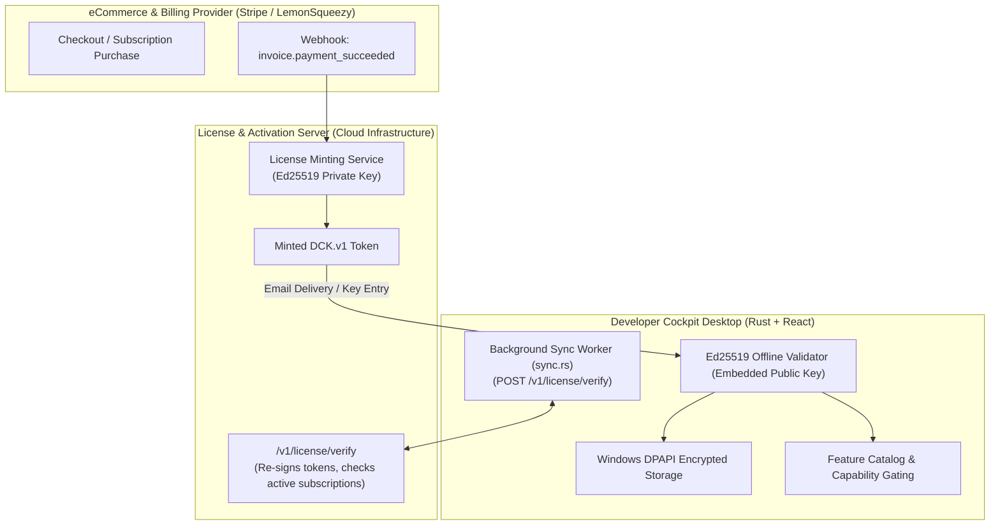

# Commercial Architecture & Enterprise Integration Guide

> **Target Audience:** Engineering Leads, System Architects, and Technical Partners evaluating, integrating, or extending Developer Cockpit's commercial engine.

---

## 1. Commercial Architecture Overview

Developer Cockpit's commercial architecture is designed around clean, decoupled interfaces in both Rust and TypeScript, allowing acquiring companies, partners, or enterprise engineering teams to integrate their own payment gateways, license servers, or enterprise entitlement systems with minimal code modification.



---

## 2. Integration Seams: Replacing or Extending the Licensing Engine

### 2.1 Replacing the Public Key (`src-tauri/src/license/offline.rs`)
The client validates tokens against a 32-byte embedded Ed25519 public key. To transition to a new keypair:
1. Generate a new keypair using the included keygen tool:
   ```bash
   cargo run -p keygen -- generate-keypair
   ```
2. Update the `EMBEDDED_PUBLIC_KEY` constant in `src-tauri/src/license/offline.rs`.

---

### 2.2 Connecting an Online Verification Server (`src-tauri/src/license/sync.rs`)
The background sync worker is already implemented in Rust and runs 10 seconds after application boot. To activate online re-verification:
1. Set the `VERIFY_URL` constant in `sync.rs`:
   ```rust
   pub const VERIFY_URL: &str = "https://api.developercockpit.app/v1/license/verify";
   ```
2. The endpoint receives `POST { "token": "DCK.v1..." }` and returns `{ "token": "<re-signed-token>" }` with updated issuance timestamps.

---

### 2.3 Integrating Payment Providers (Stripe / LemonSqueezy / Paddle)
Developer Cockpit requires no custom SDKs from payment providers inside the desktop binary:
1. When a user purchases on your website (via Stripe Checkout or LemonSqueezy), your webhook listener receives the payment notification.
2. The server signs a `DCK.v1` payload using the Ed25519 private key.
3. The server emails the license string to the customer.
4. The user pastes the key into Developer Cockpit (Settings -> License), instantly activating Pro features offline.

---

### 2.4 Implementing Custom Enterprise Tiers
To introduce new tiers (e.g., `"team"` or `"enterprise"`):
1. Update `Edition` type in `src/types/license.ts` to `"free" | "pro" | "team" | "enterprise"`.
2. Update `editionSatisfies()` logic in `src/services/license/feature-catalog.ts`.
3. Add enterprise-only capabilities to `FeatureId` and `FEATURE_CATALOG`.

---

## 3. Security Considerations & Implementation Boundaries

| Subsystem | Current Implementation Status | Security / Production Notes |
| :--- | :--- | :--- |
| **Offline Signature Verification** | **VERIFIED** (Ed25519) | Cryptographically robust; cannot be forged without the private key. |
| **Local Token Encryption** | **VERIFIED** (Windows DPAPI) | Prevents cross-user / cross-machine file copying on Windows. |
| **30-Day Offline Policy** | **VERIFIED** (`policy.rs`) | Unit-tested with injected mock clocks. Suspended when `sync_enabled` is false. |
| **Online Verification Endpoint** | **PARTIALLY VERIFIED** | Rust client implemented; endpoint URL is empty pending server deployment. |
| **Email Sign-In Exchange** | **PARTIALLY VERIFIED** | Client command returns a clear error directing users to paste license keys until the auth portal is live. |
