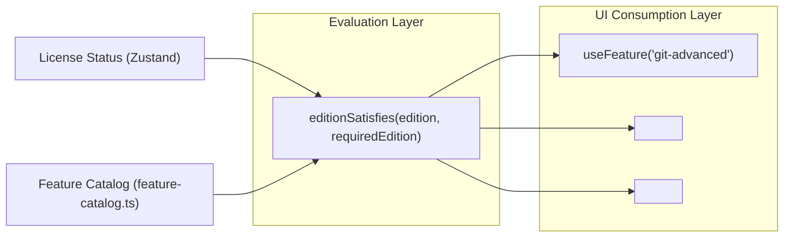

# Feature Flag & Capability Architecture

> **Status:** Verified against Developer Cockpit v0.1.0 codebase.

---

## 1. The Architectural Principle: Feature Capabilities vs. Edition Checks

In traditional applications, feature gating is frequently implemented with scattered boolean flags:
```tsx
// ❌ SCATTERED DIRECT EDITION CHECK
if (license.edition === "pro") {
  return <AdvancedGitGraph />;
}
```

This pattern creates tight coupling, makes pricing tier adjustments difficult, and obscures the relationship between marketing features and code components.

Developer Cockpit employs a **Capability-Driven Feature Flag Architecture**:
```tsx
// ✅ CAPABILITY-DRIVEN PATTERN
const isGitAdvancedEnabled = useFeature("git-advanced");
if (isGitAdvancedEnabled) {
  return <AdvancedGitGraph />;
}
```



---

## 2. Feature Catalog Schema (`src/services/license/feature-catalog.ts`)

Every feature flag is registered in `feature-catalog.ts` with explicit type safety and descriptive metadata:

```typescript
export type FeatureId =
  | "workspaces"
  | "launcher-multi-step"
  | "docker"
  | "ssh"
  | "git-advanced"
  | "ports"
  | "snippets-sync"
  | "plugins"
  | "cloud-sync";

export interface FeatureMetadata {
  id: FeatureId;
  title: string;
  tagline: string;
  benefits: string[];
  requiredEdition: Edition; // 'free' | 'pro'
}
```

### Complete Catalog Definitions
- **`workspaces`**: Workspace snapshot and restore.
- **`launcher-multi-step`**: Automated multi-step project launch sequences.
- **`docker`**: Docker Compose grouping, dependency graphs, live logs, and Docker Doctor.
- **`ssh`**: SSH connection profile manager and direct terminal launch.
- **`git-advanced`**: SVG commit graph, stashes, tags, merge/cherry-pick assistants, analytics.
- **`ports`**: Live socket inspection, Win32 memory traversal, process tree kill, restart.
- **`plugins`**: Extensibility SDK, sandboxed runtime, and custom sidebar modules.
- **`snippets-sync`**: *(Planned)* Cross-device snippet sync.
- **`cloud-sync`**: *(Planned)* Settings and workspace cloud sync.

---

## 3. How to Register a New Feature Flag

Adding a new capability to Developer Cockpit requires three simple steps:

1. **Add the Identifier to `FeatureId`:**
   ```typescript
   export type FeatureId = ... | "kubernetes-viewer";
   ```
2. **Declare Metadata in `FEATURE_CATALOG`:**
   ```typescript
   "kubernetes-viewer": {
     id: "kubernetes-viewer",
     title: "Kubernetes Cluster Viewer",
     tagline: "Inspect local and remote pods directly in your workspace.",
     benefits: [
       "Live pod and service status tables",
       "Streaming pod container logs",
       "One-click kubectl port-forwarding"
     ],
     requiredEdition: "pro"
   }
   ```
3. **Wrap UI Components:**
   ```tsx
   <ProGate feature="kubernetes-viewer">
     <KubernetesView />
   </ProGate>
   ```
