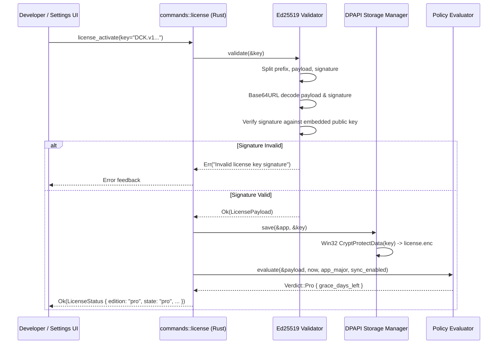

# License Manager & Cryptographic Validation

> **Status:** VERIFIED (Phase 1, Phase 12 & Licensing Engine Implementation)  
> **Source Locations:** `src-tauri/src/license/`, `src-tauri/src/commands/license.rs`, `scripts/keygen/`

---

## 1. Cryptographic Token Format (`DCK.v1`)

Developer Cockpit utilizes an offline-first asymmetric digital signature scheme based on **Ed25519** (`ed25519-dalek: 2.0`):

```
DCK.v1.<base64url_payload>.<base64url_signature>
```



### 1.1 Payload Structure
```json
{
  "v": 1,
  "edition": "pro",
  "email": "alex@enterprise.com",
  "issued_at": 1700000000,
  "expires_at": null,
  "license_id": "c7a8b412-8e10-4f40-8b1e-28b93f18cb6d",
  "issuance_timestamp": 1750000000,
  "major_version_allowance": 1
}
```

---

## 2. Storage Security: Windows DPAPI

To ensure that license tokens cannot be copied from machine to machine or accessed across different user accounts on the same workstation, Developer Cockpit encrypts the active token using the **Windows Data Protection API (DPAPI)**:

- **Storage Location:** `%APPDATA%\com.developercockpit.app\license.enc`
- **Encryption API:** `CryptProtectData` (`CRYPTPROTECT_UI_FORBIDDEN`)
- **Decryption API:** `CryptUnprotectData`
- **Security Boundary:** Bound to the Windows user's login credentials and master key. Decryption fails if the file is moved to another machine or another Windows user profile.

---

## 3. Business Rules & Offline Policy Engine (`policy.rs`)

Once a key's cryptographic signature is verified against the embedded public key, `policy::evaluate()` determines the active tier:

1. **Major Version Allowance:**
   If the running application's major version exceeds `major_version_allowance` (e.g. app is v2.0.0, but key covers major version 1), the result is `Verdict::VersionNotCovered`.
2. **Offline Grace Period:**
   - Designed to allow subscription licenses or enterprise keys to operate offline for up to 30 days (`OFFLINE_GRACE_SECS = 2,592,000`).
   - If `sync_enabled` is `false` (default shipping configuration when no verification server is configured), grace period countdowns are suspended, ensuring legitimate offline users are never locked out.

---

## 4. Key Generator CLI (`scripts/keygen/`)

A dedicated command-line utility in Rust provides keypair generation, token signing, and token inspection for administrative workflows:

```bash
# Generate a new Ed25519 signing keypair
cargo run -p keygen -- generate-keypair

# Sign a new Pro perpetual license
cargo run -p keygen -- sign \
  --email "developer@example.com" \
  --edition "pro" \
  --major-version 1 \
  --secret-key "<32-byte-hex-secret-key>"

# Inspect and verify an existing token
cargo run -p keygen -- verify \
  --token "DCK.v1..." \
  --public-key "<32-byte-hex-public-key>"
```
