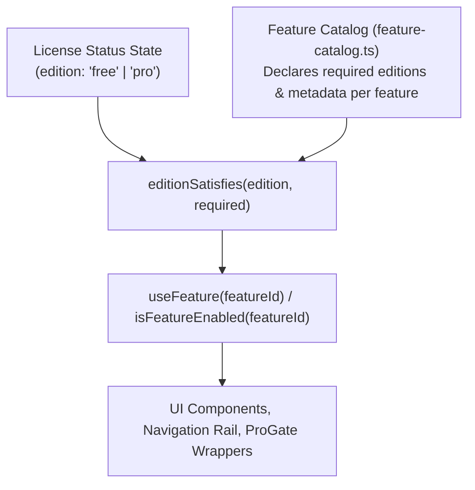
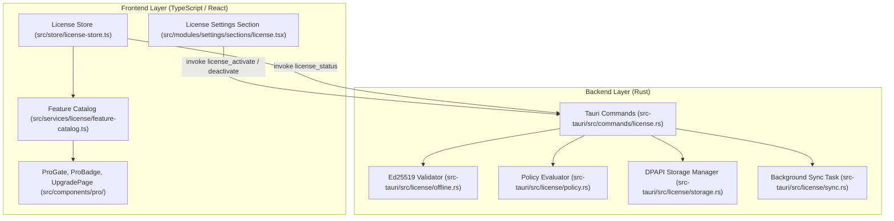

# Commercial & Licensing Architecture — Overview

> **Status:** Verified against Developer Cockpit v0.1.0 codebase.

---

## 1. Architectural Philosophy: Capability-Driven Gating

A core architectural principle of Developer Cockpit is that **features are controlled through centralized feature capabilities/flags rather than scattering direct edition checks throughout the application.**

Instead of hardcoding checks like:
```tsx
// ❌ ANTI-PATTERN: Direct edition check scattered in components
if (edition === "pro") {
  renderDockerWorkspace();
}
```

Developer Cockpit routes all feature enablement checks through the **Feature Catalog** and capability queries:
```tsx
// ✅ CAPABILITY-DRIVEN PATTERN: Centralized capability evaluation
const isDockerEnabled = useFeature("docker");

// Or declaratively:
<ProGate feature="docker">
  <DockerWorkspaceView />
</ProGate>
```



### 1.1 Key Benefits of Capability-Driven Gating
1. **Decoupled Business Logic:** Adding a new feature, transitioning a Pro feature to Free, or creating an intermediate tier (e.g. "Team" or "Enterprise") requires modifying only the central Feature Catalog (`feature-catalog.ts`), not dozens of UI files.
2. **Rich Upgrade Context:** The Feature Catalog attaches descriptive metadata (title, tagline, benefits list) to each feature identifier, allowing the `ProGate` component to render rich, feature-specific upgrade guidance automatically.
3. **Auditability:** Every gateable capability in the application is explicitly enumerated in a single TypeScript union type (`FeatureId`), preventing undocumented or accidental feature gating.

---

## 2. Licensing Subsystem Components

The commercial architecture spans both frontend and backend boundaries:



---

## 3. Documentation Index

For detailed specifications on each aspect of the commercial and licensing architecture, refer to:

- **[FREE_EDITION.md](./FREE_EDITION.md)**: Capabilities, default state, and zero-configuration developer experience.
- **[PRO_EDITION.md](./PRO_EDITION.md)**: Pro features, workflow orchestration, and enterprise value propositions.
- **[FEATURE_FLAGS.md](./FEATURE_FLAGS.md)**: The `FeatureCatalog`, `FeatureId` taxonomy, and gating mechanics.
- **[LICENSE_MANAGER.md](./LICENSE_MANAGER.md)**: Ed25519 token format (`DCK.v1`), cryptographic validation, DPAPI encryption, and the 30-day offline policy.
- **[COMMERCIAL_ARCHITECTURE.md](./COMMERCIAL_ARCHITECTURE.md)**: Payment gateway integration points, future server architecture, and migration guide for enterprise engineering teams.
