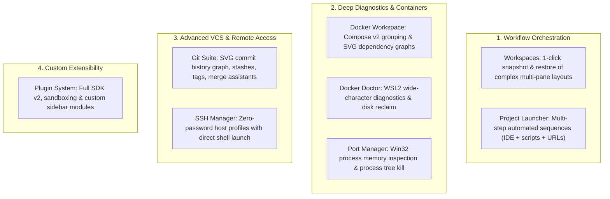

# Pro Edition Architecture & Capabilities

> **Status:** Verified against Developer Cockpit v0.1.0 codebase.

---

## 1. Pro Edition Value Proposition

The **Pro Edition** of Developer Cockpit targets senior engineers, technical leads, and full-stack developers managing complex multi-service architectures on Windows. It transforms the app from a set of individual developer utilities into an intelligent, project-aware developer workspace.

---

## 2. Unlocked Pro Capabilities

### Detailed Feature Breakdown
1. **Workspace Manager (`workspaces`):** Eliminates layout setup friction by persisting terminal split hierarchies and directory bindings directly in SQLite.
2. **Multi-Step Project Launcher (`launcher-multi-step`):** Chains IDE launch, multiple terminal tabs running dev servers, browser startup, and folder navigation into a single click.
3. **Port Manager (`ports`):** Unlocks direct Win32 memory traversal (`NtQueryInformationProcess`, `ReadProcessMemory`), exposing the command-line arguments and working directory of listening processes, and enabling process tree killing.
4. **Docker Workspace & Doctor (`docker`):** Automatically maps Compose v2 stacks, renders SVG dependency hierarchies, provides low-latency log streaming over Tauri Channels, and executes WSL2 UTF-16LE health checks.
5. **Advanced Git Dashboard (`git-advanced`):** Visualizes multi-branch commit topologies, resolves merge/cherry-pick conflicts with step-by-step guidance, and tracks contributor velocity.
6. **SSH Manager (`ssh`):** Organizes remote connection profiles with direct terminal launching and a zero-password security model.
7. **Plugin System (`plugins`):** Unlocks `@developer-cockpit/plugin-sdk` to load custom sidebar modules, overview widgets, and sandboxed automations.

---

## 3. Perpetual vs. Subscription Licensing Support

The underlying Ed25519 token format (`DCK.v1`) natively supports both commercial licensing models:
- **Perpetual Licenses:** The payload sets `"expires_at": null` and specifies `"major_version_allowance": 1`. The key is valid indefinitely for all minor/patch updates within that major version without requiring internet re-verification.
- **Subscription Licenses:** The payload sets `"expires_at": <unix_timestamp>`. The policy evaluator enforces the expiration boundary while offering a 30-day offline grace window between online verification syncs.
