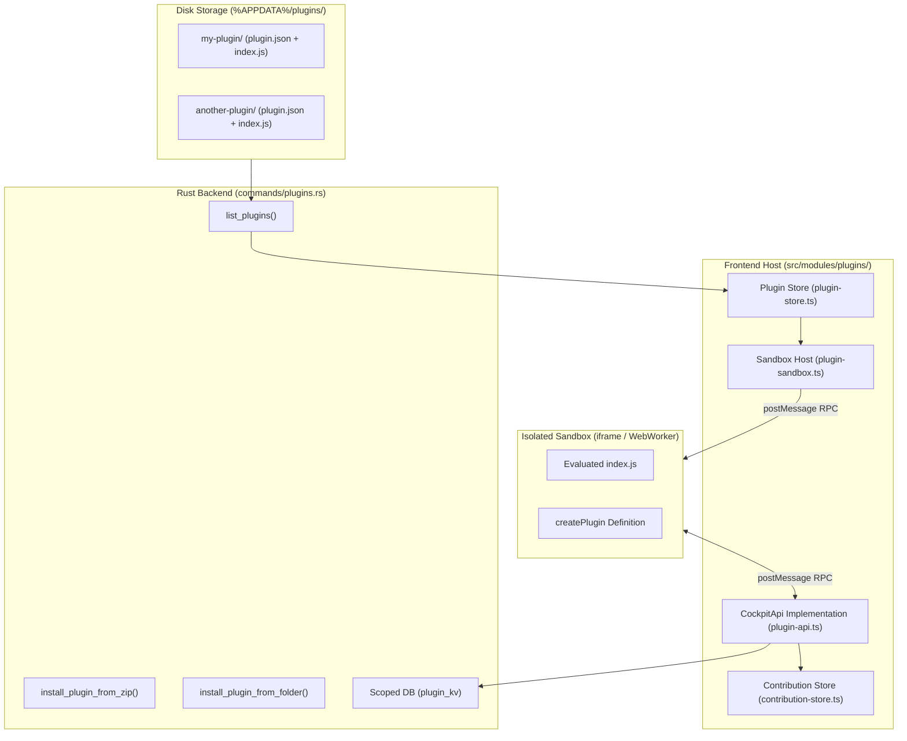

# Plugin System — Runtime Architecture

> **Status:** VERIFIED (Phase 11 & Phase 13 Implementation)  
> **Source Locations:** `sdk/`, `src/modules/plugins/`, `src-tauri/src/commands/plugins.rs`

---

## 1. System Architecture

The plugin runtime separates plugin discovery (Rust host), sandbox mediation (TypeScript RPC), and UI rendering (Webview iframe):

---

## 2. Backend Discovery Engine (`commands/plugins.rs`)

The backend scans `%APPDATA%\com.developercockpit.app\plugins\` on startup or on demand:
- **`plugins_dir`**: Returns the absolute directory path.
- **`list_plugins`**: Reads every subfolder, reading `plugin.json` and `index.js` as raw text streams without executing them in Rust.
- **`install_plugin_from_zip` / `install_plugin_from_folder`**: Validates manifest structure and uncompresses/copies folders into the active plugins directory.
- **`uninstall_plugin`**: Removes the plugin directory from disk.

---

## 3. Sandboxed RPC Bridge (`plugin-sandbox.ts`)

To ensure security and interface stability:
1. **Execution Context:** The host dynamically creates a hidden sandboxed `<iframe>` or `WebWorker` with restricted permissions (`sandbox="allow-scripts"` without `allow-same-origin` or direct host DOM access).
2. **RPC Protocol:** The host serializes the plugin's code into the sandbox. All interactions (such as invoking `api.storage.get()`, `api.openTerminalTab()`, or registering contributions) communicate across an asynchronous `postMessage` RPC protocol.
3. **Host-Side Enforcement:** The host strictly checks parameter formats, enforcing storage quotas (50 keys max, 100 KB max per value) and prefixing key namespaces before committing to SQLite.
