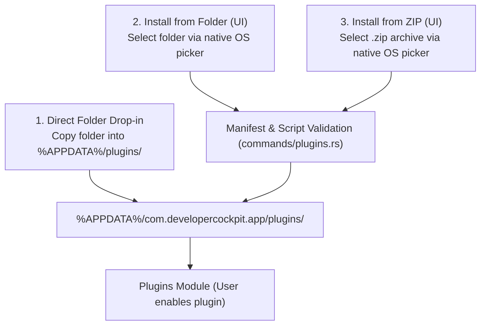

# Plugin Distribution & Installation

> **Status:** VERIFIED (Phase 11 & Phase 13 Implementation)  
> **Source Locations:** `src-tauri/src/commands/plugins.rs`, `src/modules/plugins/components/MarketplaceTab.tsx`

---

## 1. Installation Methods

Developer Cockpit supports three verified methods for installing plugins:

---

## 2. Step-by-Step Installation Guides

### 2.1 Installing via ZIP Archive (Recommended for Distribution)
1. Package your plugin folder into a `.zip` archive containing `plugin.json` and `index.js` at the root.
2. In Developer Cockpit, navigate to the **Plugins** module.
3. Click **"Install from ZIP"**.
4. Select the `.zip` file. The backend automatically extracts and validates the manifest.
5. Toggle the **Enable** switch to activate the plugin.

---

### 2.2 Installing via Folder Selection
1. In the **Plugins** module, click **"Install from folder"**.
2. Select any local folder containing `plugin.json` and `index.js`.
3. The backend copies the folder into the app's internal plugins directory and registers the plugin.

---

### 2.3 Manual Drop-In
1. Click **"Open folder"** in the Plugins module to reveal `%APPDATA%\com.developercockpit.app\plugins\`.
2. Create a new subfolder and place `plugin.json` and `index.js` inside.
3. Click **"Reload"** in Developer Cockpit.

---

## 3. Uninstallation

- Clicking the trash/uninstall icon in the Plugins module invokes `commands::plugins::uninstall_plugin`, which gracefully cleans up registered contributions, deletes the plugin directory from disk, and removes its trust state from SQLite.
