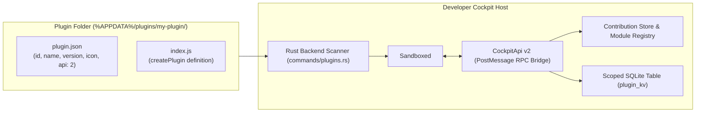

# Developer Cockpit Plugin SDK — Overview

> **Package:** `@developer-cockpit/plugin-sdk`  
> **API Version:** v2 (Current) & v1 (Legacy backward compatibility)  
> **Source Location:** `sdk/` and `src/modules/plugins/`

---

## 1. Plugin System Vision

The **Developer Cockpit Plugin SDK** allows third-party developers, internal engineering tooling teams, and community contributors to extend the Developer Cockpit desktop application with:
- **Custom Sidebar Modules:** Full-page custom tools appearing alongside built-in modules.
- **Dashboard Metric Panels:** Real-time widgets integrated into the main Overview Dashboard.
- **Command Palette Actions:** Custom commands and terminal scripts searchable in `Ctrl+K`.
- **Context Menu Actions:** Custom right-click operations on Docker containers and Project cards.
- **Settings Sub-Pages:** Dedicated configuration screens under the Settings Hub.
- **Project Import Detectors:** Heuristics identifying proprietary repository formats and proposing launch scripts.
- **Scoped Key-Value Storage:** Isolated SQLite persistence for plugin state.

---

## 2. Core Design Principles

1. **Zero-Build Plain JavaScript Support:** A plugin is simply a folder containing `plugin.json` (manifest) and `index.js` (an ES module). No compilation step is required for vanilla JavaScript. TypeScript developers compile/bundle against `@developer-cockpit/plugin-sdk` into a single `index.js` file.
2. **Strict Sandboxed Execution:** Plugins run inside sandboxed `<iframe>` or `WebWorker` contexts. Plugin code cannot directly access the host DOM, parent `window`, or native Rust bindings.
3. **Explicit User Trust:** Newly discovered plugins are disabled by default. The user must explicitly toggle them on in the Cockpit UI.
4. **Additive, Versioned API Contract:** The `CockpitApi` is versioned. Breaking changes are avoided, and older plugins targeting API v1 continue to function alongside API v2 plugins.

---

## 3. Architecture at a Glance

---

## 4. Documentation Index

- **[ARCHITECTURE.md](./ARCHITECTURE.md)**: Host runtime, sandboxing, and RPC communication.
- **[PLUGIN_LIFECYCLE.md](./PLUGIN_LIFECYCLE.md)**: Discovery, validation, activation, mount/unmount, and deactivation.
- **[API.md](./API.md)**: Complete `CockpitApi` v2 method reference and contribution schemas.
- **[DEVELOPING_PLUGINS.md](./DEVELOPING_PLUGINS.md)**: Authoring guide, bundling, and local testing.
- **[INSTALLATION.md](./INSTALLATION.md)**: Installation from folders, ZIP packages, and manual drop-in.
- **[SECURITY.md](./SECURITY.md)**: Sandboxing boundaries, storage quotas, and security considerations.
- **[EXAMPLES.md](./EXAMPLES.md)**: Verified SDK code examples (Hello World, Custom Sidebar, Dashboard Widget).
- **[ROADMAP.md](./ROADMAP.md)**: Future SDK capabilities and planned extension points.
