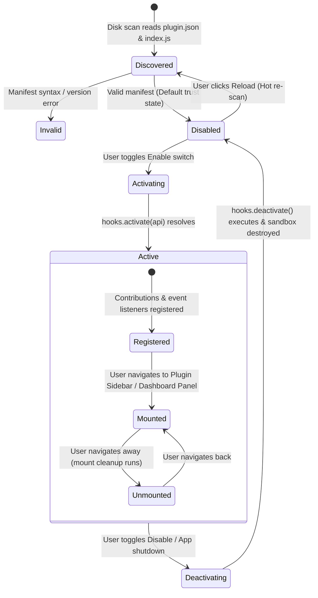

# Plugin Lifecycle & State Machine

> **Status:** VERIFIED (Phase 11 & Phase 13 Implementation)  
> **Source Locations:** `sdk/src/index.ts`, `src/modules/plugins/services/plugin-runtime.ts`

---

## 1. Plugin Lifecycle States

Developer Cockpit governs plugins through a deterministic state machine:

---

## 2. Lifecycle Phases Explained

### 2.1 Discovery & Validation
1. Backend scans `%APPDATA%\plugins\<folder>\`.
2. Verifies `plugin.json`:
   - `id`: Must match regex `^[a-z][a-z0-9-]{1,31}$` and collide with no built-in module ID.
   - `api`: Must be `2` (or `1` for legacy plugins). If higher than host capabilities, marked as `error: "Requires newer Developer Cockpit"`.
   - `minAppVersion`: Validated against running app semver.

### 2.2 Activation (`hooks.activate`)
When enabled:
- The sandbox initializes a dedicated logic worker.
- Executes `hooks.activate(api)` if declared in the plugin definition.
- Registers contributions (sidebar, dashboard panels, palette commands, context menus, project detectors) into the host's `ContributionStore`.

### 2.3 UI View Mounting & Cleanup
- When a user navigates to the plugin's custom sidebar view or views a dashboard card, the host calls `sidebar.mount(container, api)`.
- The `mount` function must return a `Cleanup` function (`() => void`).
- When the user switches views, the returned `Cleanup` executes to tear down timers, DOM elements, or canvas renderers.

### 2.4 Deactivation (`hooks.deactivate`)
- When disabled or during app shutdown:
  - Host runs all active view cleanups.
  - Executes `hooks.deactivate()`.
  - Removes all contributed commands, menus, and dashboard widgets from the UI.
  - Terminates the sandbox worker/frame.

### 2.5 Hot Reloading
- Clicking **"Reload"** in the Plugins module clears cached module bundles and re-evaluates `index.js` on disk immediately without restarting the host application.
