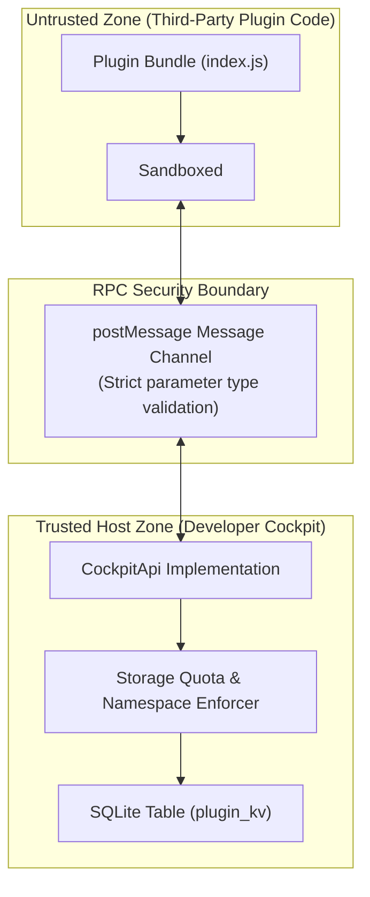

# Plugin Security Architecture & Sandboxing

> **Status:** VERIFIED (Phase 11 & Phase 13 Implementation)  
> **Source Locations:** `src/modules/plugins/services/plugin-sandbox.ts`, `src/modules/plugins/services/plugin-storage.ts`

---

## 1. Security Architecture Principles

To protect developer workstations while providing extensibility, Developer Cockpit implements a multi-layer sandbox security boundary:

---

## 2. Sandbox Controls & Isolation

1. **DOM Isolation:** Plugin code executes in a sandboxed context without access to the host document DOM, preventing UI spoofing or session token extraction.
2. **Asynchronous RPC Bridge:** All interactions pass through structured `postMessage` RPC commands. Calls are validated host-side against schemas before execution.
3. **No Direct Native FFI Access:** Plugins cannot access Tauri Rust invoke commands directly. All native capabilities (terminal spawning, notifications) are mediated via the typed `CockpitApi`.

---

## 3. Persistent Storage Security & Quotas

Storage accessed via `api.storage` is guarded by strict host-side validation (`plugin-storage.ts`):

- **Key Format Enforcement:** Keys must match regex `^[a-z0-9._-]{1,64}$`.
- **Value Size Limits:** Maximum value size is strictly capped at **100 KB** per key to prevent disk flooding.
- **Key Count Quotas:** Maximum of **50 keys** per plugin.
- **Namespace Isolation:** Keys are stored in SQLite composite primary keys `(plugin_id, key)`, ensuring one plugin cannot read or write to another plugin's storage.

---

## 4. Trust Model: Disabled by Default

When a plugin is placed in the plugins folder:
- It is initially marked as **disabled** in the `plugin_settings` database table.
- The host displays the plugin's metadata in the Plugins manager.
- Code execution is halted until the user explicitly toggles the **Enable** switch.
